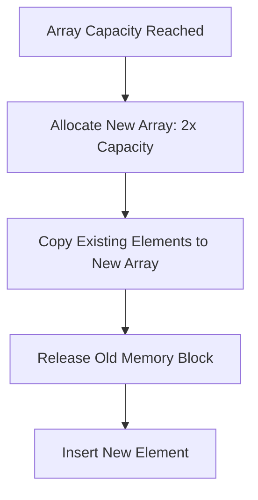

Arrays are the most fundamental data structure in computer science. Almost every other structure — from stacks and queues to hash maps and matrices — uses arrays as their underlying storage layer. To write fast, memory-efficient code, you need to deeply understand how arrays interact with hardware, memory management, and CPU performance profiles.

---

## Contiguous Memory and CPU Cache Locality

An array is a collection of elements stored in **contiguous** (sequential) memory locations. When you initialize an array of integers, the operating system allocates a single, unbroken block of bytes.

```text
Memory Address:  [1000]   [1004]   [1008]   [1012]   [1016]
Array Index:     [ 0  ]   [ 1  ]   [ 2  ]   [ 3  ]   [ 4  ]
Values stored:   [ 42 ]   [ 19 ]   [ 88 ]   [  5 ]   [ 73 ]
```

Because memory is contiguous, calculating the physical address of any element is a simple mathematical equation:

```text
Address(A[i]) = Base_Address + i * Element_Size
```

This arithmetic calculation takes constant time (`O(1)`). You do not need to traverse the array to find the 100th element; the CPU calculates its exact memory location instantly.

### The Power of Cache Locality

Contiguous layouts exploit **CPU Cache Locality** (specifically, Spatial Locality). When the CPU requests a single element from RAM (e.g., `A[0]`), the memory controller doesn't just fetch that single integer. It retrieves an entire **cache line** (typically 64 bytes on modern x86/ARM architectures) containing adjacent elements (e.g., `A[1]`, `A[2]`, `A[3]`) and loads it into the ultra-fast L1 CPU cache.

Iterating through arrays sequentially is extremely fast because subsequent elements are already in the L1 cache, avoiding high-latency round trips to main memory. This is why arrays often outperform linked lists in real-world benchmarks, even for operations where linked lists theoretically have better Big-O complexity.

---

## Multidimensional Arrays and Memory Layout

When you create a 2D array (a matrix), memory is still fundamentally 1D (linear). Languages map 2D coordinates `[row][col]` to a 1D memory layout in one of two ways:

1. **Row-Major Order** (C, C++, Python, C#): Elements of a row are stored contiguously.
2. **Column-Major Order** (Fortran, MATLAB, R): Elements of a column are stored contiguously.

If you iterate through a row-major matrix column-by-column, you destroy cache locality and cause cache misses on every read, slowing down your algorithm by an order of magnitude.

```ts
// Bad: Cache misses on every iteration (Column-Major Traversal in Row-Major language)
for (let col = 0; col < COLS; col++) {
  for (let row = 0; row < ROWS; row++) {
    sum += matrix[row][col]; 
  }
}

// Good: Excellent cache locality (Row-Major Traversal)
for (let row = 0; row < ROWS; row++) {
  for (let col = 0; col < COLS; col++) {
    sum += matrix[row][col];
  }
}
```

---

## Static vs. Dynamic Arrays

Static arrays (like `int arr[10]` in C) have a fixed size defined at allocation. Their sizes cannot change during program execution.

To support variable-sized collections, languages implement dynamic arrays (like JavaScript `Array`, Python `list`, Java `ArrayList`, or C++ `std::vector`). Dynamic arrays automate memory allocation when elements exceed capacity.

### The Resizing Lifecycle
When capacity is exceeded:
1. A new memory block of double the size (e.g., capacity goes from 4 to 8) is allocated.
2. All existing elements are deep-copied to the new block.
3. The old memory block is deallocated (or garbage collected).
4. The new element is inserted.



### Amortized Time Complexity of Dynamic Resizing

Although resizing requires copying $N$ elements, which takes $O(N)$ time, it happens rarely. On average, the push operation still runs in **$O(1)$ amortized time**.

Let's prove this. If you push $N$ elements into an empty dynamic array that doubles starting from capacity 1:
- Resizes happen at element counts: 1, 2, 4, 8, 16, ...
- Total copy operations: 1 + 2 + 4 + 8 + ... + N/2
- This is a geometric series that sums to roughly 2N.
- Average cost per push = (N pushes + 2N copies) / N = 3 operations = `O(1)` amortized.

---

## Complexity Profiles of Array Operations

| Operation | Scenario | Time Complexity | Rationale |
|---|---|---|---|
| **Access / Read** | `arr[i]` | $O(1)$ | Direct memory address calculation via formula. |
| **Search** | Unsorted | $O(N)$ | Must scan all elements sequentially. |
| **Search** | Sorted | $O(\log N)$ | Binary search eliminates half the space per step. |
| **Insert** | End (Static) | $O(1)$ | Direct memory write. |
| **Insert** | End (Dynamic) | $O(1)$ amortized | Direct write, with rare $O(N)$ resize copies. |
| **Insert** | Beginning / Middle | $O(N)$ | Must shift all trailing elements to the right to make space. |
| **Delete** | End | $O(1)$ | Simply decrease the internal element counter. |
| **Delete** | Beginning / Middle | $O(N)$ | Must shift all trailing elements to the left to close the gap. |

Because inserting or deleting at the beginning takes $O(N)$, you should never use a standard Array to implement a First-In-First-Out Queue if performance is critical (use a Linked List or Circular Buffer instead).

---

## Algorithmic Patterns on Arrays

When solving array problems in interviews, several common patterns emerge:

### 1. The Two-Pointer Technique
Used when you need to search for pairs in a sorted array, or reverse an array in-place.
- Place one pointer at the start `left = 0`.
- Place one pointer at the end `right = arr.length - 1`.
- Move them toward each other based on conditions.

### 2. The Sliding Window Technique
Used to find contiguous sub-arrays (e.g., maximum sum of a subarray of size $K$).
- Maintain a "window" of elements `arr[left...right]`.
- Expand `right` to include elements.
- Shrink `left` to remove elements when constraints are violated.

---

## Implementing Dynamic Arrays from Scratch (TypeScript)

To truly understand dynamic arrays, here is a complete, production-ready implementation managing capacity scaling and memory shifting under the hood.

```ts
/**
 * A custom implementation of a Dynamic Array representing how ArrayList or vector works under the hood.
 */
class CustomDynamicArray<T> {
  private data: (T | undefined)[];
  private length: number;
  private capacity: number;

  constructor(initialCapacity = 4) {
    this.data = new Array<T>(initialCapacity);
    this.length = 0;
    this.capacity = initialCapacity;
  }

  // O(1) Access
  public get(index: number): T | undefined {
    if (index < 0 || index >= this.length) return undefined;
    return this.data[index];
  }

  // O(1) Amortized Push
  public push(value: T): void {
    if (this.length === this.capacity) {
      this.resize();
    }
    this.data[this.length] = value;
    this.length++;
  }

  // O(N) Insertion
  public insertAt(index: number, value: T): void {
    if (index < 0 || index > this.length) throw new Error('Index out of bounds');
    if (this.length === this.capacity) {
      this.resize();
    }
    
    // Shift elements to the right starting from the end
    for (let i = this.length; i > index; i--) {
      this.data[i] = this.data[i - 1];
    }
    this.data[index] = value;
    this.length++;
  }

  // O(N) Deletion
  public removeAt(index: number): T {
    if (index < 0 || index >= this.length) throw new Error('Index out of bounds');
    const removedValue = this.data[index] as T;
    
    // Shift elements to the left to fill the gap
    for (let i = index; i < this.length - 1; i++) {
      this.data[i] = this.data[i + 1];
    }
    
    // Clear out the trailing ghost element for garbage collection
    this.data[this.length - 1] = undefined;
    this.length--;
    
    return removedValue;
  }

  // O(N) Resize
  private resize(): void {
    this.capacity = this.capacity * 2;
    const newArray = new Array<T>(this.capacity);
    
    // Deep copy existing items to new contiguous block
    for (let i = 0; i < this.length; i++) {
      newArray[i] = this.data[i];
    }
    
    this.data = newArray; // Old array is marked for garbage collection
  }

  public getLength(): number {
    return this.length;
  }
}
```

For structural variations of lists that avoid contiguous shifts, see [linked lists](/blog/dsa-linked-lists). For how arrays are sorted, see [sorting algorithms](/blog/dsa-sorting-algorithms).

## Related Articles

- [Demystifying Linked Lists: Traversal, Pointers, and Reversal](/blog/dsa-linked-lists)
- [Sorting Visualized: Comparisons, Stability, and Complexities](/blog/dsa-sorting-algorithms)
