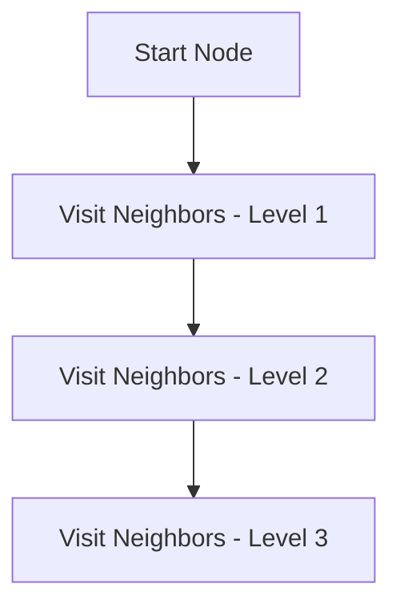
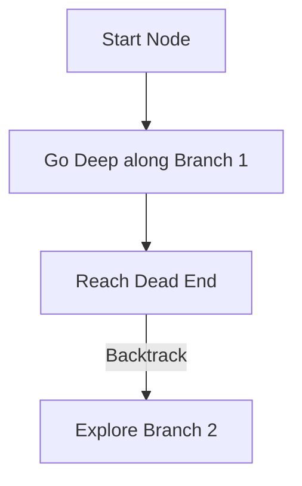

Graphs are the most versatile data structure in computer science. They are used to model networks of connected elements: from friends on a social network and streets on Google Maps, to routers on the internet and dependencies in a package manager.

A graph consists of a set of **Nodes** (Vertices) connected by **Links** (Edges). Edges can be *Directed* (one-way streets) or *Undirected* (two-way streets), and they can carry a *Weight* (representing cost or distance).

---

## Graph Representation: List vs. Matrix

How do we actually store a graph in code? There are two primary approaches, and choosing the wrong one will crash your system due to memory limits (Out of Memory errors).

### 1. Adjacency Matrix
A 2D array (Grid) where cell `matrix[i][j]` is 1 if there is an edge between vertex `i` and vertex `j`, and 0 otherwise.

```text
   0  1  2
0  0  1  0
1  1  0  1
2  0  1  0
```

- **Pros:** Blazing fast $O(1)$ time to check if an edge exists between two nodes.
- **Cons:** Astronomical $O(V^2)$ memory usage. If you have 1 million users on a social network, an adjacency matrix requires $1,000,000 \times 1,000,000 = 1 \text{ Trillion}$ cells, eating up Terabytes of RAM, even if each user only has 10 friends.

### 2. Adjacency List (The Standard)
An array of lists (or a Hash Map of Arrays) where index `i` stores a list of all vertices strictly connected to vertex `i`. 

```text
0: -> [ 1 ]
1: -> [ 0, 2 ]
2: -> [ 1 ]
```

- **Pros:** Highly space-efficient $O(V + E)$ memory usage. Perfect for "Sparse Graphs" (graphs where most nodes are NOT connected to most other nodes, which is 99% of real-world graphs).
- **Cons:** Slower edge checks ($O(V)$ in the worst case to iterate through a user's friend list to find a specific friend).

---

## BFS vs. DFS: Exploring Graphs

To search a graph, you must traverse it without getting trapped in an infinite cycle.

### Breadth-First Search (BFS)
BFS explores the graph level-by-level. It visits all immediate neighbors of a node (Level 1) before moving to their neighbors (Level 2).
- **Underlying Structure:** Uses a **Queue** (FIFO).
- **Superpower:** BFS is guaranteed to find the **Shortest Path** in an unweighted graph. It is the core algorithm behind solving mazes or finding degrees of separation.



### Depth-First Search (DFS)
DFS acts like a rat in a maze: it explores a single branch as deeply as possible before backtracking.
- **Underlying Structure:** Uses a **Stack** (or Call Stack via Recursion).
- **Superpower:** DFS is incredibly memory efficient for deep graphs and is the required algorithm for **Topological Sorting** (ordering compilation dependencies) and detecting cycles.



---

## Traverse Implementations (TypeScript)

Here is a full Object-Oriented class implementation demonstrating both BFS and DFS traversals on an adjacency list.

```ts
class Graph {
  // Using a Map for the Adjacency List
  private adjList: Map<number, number[]>;

  constructor() {
    this.adjList = new Map();
  }

  public addVertex(v: number): void {
    if (!this.adjList.has(v)) {
      this.adjList.set(v, []);
    }
  }

  public addEdge(v: number, w: number): void {
    this.addVertex(v);
    this.addVertex(w);
    // Undirected graph: add edge in both directions
    this.adjList.get(v)!.push(w);
    this.adjList.get(w)!.push(v); 
  }

  // Breadth-First Search (using a Queue)
  public bfs(startNode: number): number[] {
    const visited = new Set<number>();
    const queue: number[] = [startNode];
    const result: number[] = [];

    visited.add(startNode);

    while (queue.length > 0) {
      const node = queue.shift()!; // Dequeue (Note: Use a real queue for O(1))
      result.push(node);

      const neighbors = this.adjList.get(node) || [];
      for (const neighbor of neighbors) {
        if (!visited.has(neighbor)) {
          visited.add(neighbor); // Mark visited IMMEDIATELY when queueing
          queue.push(neighbor);
        }
      }
    }
    return result;
  }

  // Depth-First Search (using Recursion / Call Stack)
  public dfs(startNode: number, visited = new Set<number>(), result: number[] = []): number[] {
    visited.add(startNode);
    result.push(startNode);

    const neighbors = this.adjList.get(startNode) || [];
    for (const neighbor of neighbors) {
      if (!visited.has(neighbor)) {
        this.dfs(neighbor, visited, result);
      }
    }
    return result;
  }
}
```

### Advanced Algorithms
If your graph edges have varying weights (e.g., travel times on roads), BFS will fail to find the fastest route. In these scenarios, you must use **Dijkstra's Algorithm**, which replaces the standard FIFO Queue with a **Priority Queue (Min-Heap)** to prioritize exploring cheaper paths first.

For queue details, see [queues](/blog/dsa-queues-fifo). For stack details, see [stacks](/blog/dsa-stacks-lifo).

## Related Articles

- [Deep Dive into Queues: FIFO Buffers and Circular Arrays](/blog/dsa-queues-fifo)
- [Understanding Stacks: LIFO Behavior and Allocation Frames](/blog/dsa-stacks-lifo)
- [Hierarchical Data: Traversing Binary Trees and BST Properties](/blog/dsa-binary-trees)
