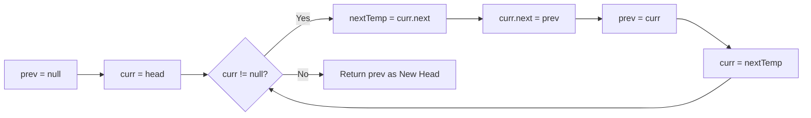

Linked lists are fundamental dynamic structures that represent sequential data. Unlike arrays, linked lists do not store elements in contiguous memory. Instead, they are scattered randomly throughout the system's RAM (the Heap). 

To maintain sequence, each element — called a **Node** — is a self-contained object that stores two things: the actual data, and a reference (or pointer) to the *next* node in the sequence.

```text
Head -> [ Val: 10 | Next ] -> [ Val: 20 | Next ] -> [ Val: 30 | Next ] -> NULL
```

Because they don't require contiguous blocks of memory, Linked Lists can easily scale and grow without ever needing to perform the expensive memory reallocation operations required by dynamic arrays.

---

## Linked Lists vs. Arrays: The Ultimate Trade-off

A deep understanding of the differences between arrays and linked lists is a staple of technical interviews. They represent a classic trade-off between **Access Speed** and **Insertion Speed**.

| Feature | Dynamic Arrays | Linked Lists |
|---|---|---|
| **Memory Layout** | Contiguous physical memory blocks | Scattered nodes stored anywhere in Heap |
| **Access Speed** | $O(1)$ random access lookup via index | $O(N)$ sequential traversal required |
| **Insert/Delete (Start)**| $O(N)$ (requires shifting all elements) | $O(1)$ (just update head pointers) |
| **Insert/Delete (End)** | $O(1)$ amortized (resizes occasionally) | $O(1)$ if tail pointer is maintained |
| **Cache Locality** | Excellent (leveraging CPU L1/L2 caches) | Poor (Pointer chasing causes cache misses) |
| **Memory Overhead** | Minimal (Just the values and array capacity) | High (Every value requires an extra 8-byte pointer) |

In modern computing, due to the extreme speeds of CPU Caches, arrays are almost always faster in practice unless you are specifically building a system that requires constant insertions and deletions at the very front of the collection.

---

## Types of Linked Lists

### 1. Singly Linked List
Each node contains a value and a single reference pointing forward (`next`). You can only traverse this list in one direction (Head to Tail).

### 2. Doubly Linked List
Each node contains a value, a forward reference (`next`), and a backward reference (`prev`).
This supports bi-directional traversals (moving forwards and backwards) at the cost of storing an extra pointer per node. Doubly linked lists are the foundation for building **LRU (Least Recently Used) Caches**, where elements must be removed from the middle in $O(1)$ time.

```text
Singly Node:  [ Data | Next ]
Doubly Node:  [ Prev | Data | Next ]
```

### 3. Circular Linked List
Instead of the last node pointing to `NULL`, the tail node points back to the Head node. This forms an infinite loop, heavily used in operating systems for Round-Robin CPU scheduling.

---

## Reversing a Singly Linked List

Reversing a singly linked list is one of the most common algorithmic interview questions. It tests your ability to safely manipulate pointers without dropping references to the rest of the list.

```text
Before:  1 -> 2 -> 3 -> NULL
After:   3 -> 2 -> 1 -> NULL
```

### Iterative Algorithm Walkthrough
To reverse a list in-place (in $O(1)$ space), we must iterate through the list and flip each pointer backward. We keep track of three pointers:
1. `prev` (initially null): Represents the reversed portion of the list.
2. `curr` (initially head): Represents the node we are currently flipping.
3. `nextTemp` (temporary): Stores the next node before we overwrite the pointer.



### Complete Code Implementation (TypeScript)

```ts
class ListNode {
  val: number;
  next: ListNode | null;

  constructor(val: number, next: ListNode | null = null) {
    this.val = val;
    this.next = next;
  }
}

function reverseList(head: ListNode | null): ListNode | null {
  let prev: ListNode | null = null;
  let curr: ListNode | null = head;

  while (curr !== null) {
    // 1. Store the remaining list so we don't lose it!
    const nextTemp: ListNode | null = curr.next;
    
    // 2. Reverse the current node's pointer
    curr.next = prev;
    
    // 3. Move both pointers one step forward
    prev = curr;
    curr = nextTemp;
  }

  // prev is the head of the newly reversed list
  return prev;
}
```

---

## Floyd's Cycle Finding Algorithm (Tortoise and Hare)

How do you check if a linked list contains a cycle (an infinite loop)? You could store every visited node in a Hash Set, but that takes $O(N)$ extra memory.

Instead, we use the **Fast and Slow Pointer Algorithm**, which uses $O(1)$ space. 
- The **Slow pointer (Tortoise)** moves one step at a time (`slow = slow.next`).
- The **Fast pointer (Hare)** moves two steps at a time (`fast = fast.next.next`).

If there is a cycle, the fast pointer will lap the slow pointer and eventually land on the exact same node. If the fast pointer reaches `null`, the list has an end and is cycle-free.

```ts
function hasCycle(head: ListNode | null): boolean {
  if (!head || !head.next) return false;

  let slow: ListNode | null = head;
  let fast: ListNode | null = head;

  // While fast can still move forward two steps...
  while (fast !== null && fast.next !== null) {
    slow = slow!.next;        // Move 1 step
    fast = fast.next.next;    // Move 2 steps

    if (slow === fast) {
      return true; // The hare caught the tortoise! Cycle detected.
    }
  }

  return false;
}
```

## Related Articles

- [Mastering Arrays: Contiguous Memory and Dynamic Scaling](/blog/dsa-arrays-guide)
- [Understanding Stacks: LIFO Behavior and Allocation Frames](/blog/dsa-stacks-lifo)
- [Deep Dive into Queues: FIFO Buffers and Circular Arrays](/blog/dsa-queues-fifo)
