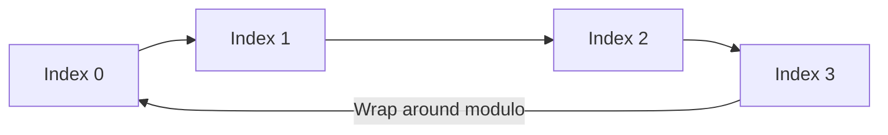

A queue is a linear data structure that rigidly follows the **First-In, First-Out (FIFO)** protocol. Elements are inserted at the back (Enqueue) and removed from the front (Dequeue). 

You can visualize a queue exactly like a line of people waiting at a grocery store checkout: the first person to enter the line is the first person to be served and leave the line.

---

## Queue Applications in Distributed Systems

While stacks are often used for local execution tracking, Queues are the backbone of asynchronous architecture, network traffic management, and horizontal scaling.

- **Message Brokers:** Software like Kafka, RabbitMQ, and AWS SQS use distributed queues to decouple microservices. A publisher enqueues a message, and a subscriber dequeues it when they are ready to process it.
- **CPU Scheduling:** Operating systems maintain "Run Queues" to manage which thread gets CPU time next.
- **Print Buffers / Rate Limiting:** Queues absorb bursts of traffic. If a printer receives 100 requests in one second, it buffers them into a queue and processes them sequentially.
- **Breadth-First Search (BFS):** Graph exploration algorithms track which node to visit next by enqueuing neighbors into a FIFO queue.

---

## The Danger of Using Dynamic Arrays for Queues

In languages like JavaScript, it is tempting to use a standard array as a queue:

```ts
const queue = [];
queue.push(10); // Enqueue: O(1)
const first = queue.shift(); // Dequeue: O(N) -> BAD!
```

**Why is `shift()` bad?** 
Because dynamic arrays use contiguous memory, removing the first element leaves a gap at `Index 0`. The runtime must physically copy and shift every single remaining element one slot to the left to close the gap. If you have a queue of 100,000 items, a single `dequeue` operation copies 99,999 items.

---

## High-Performance Queue Implementations

To achieve $O(1)$ performance for both enqueue and dequeue operations, you must use either a **Linked List** or a **Circular Array (Ring Buffer)**.

### 1. Linked List Queue
A Linked List is a great choice because removing from the Head is $O(1)$ and adding to the Tail is $O(1)$ (if you maintain a tail pointer).

```ts
class ListNode<T> {
  constructor(public val: T, public next: ListNode<T> | null = null) {}
}

class LinkedListQueue<T> {
  private head: ListNode<T> | null = null;
  private tail: ListNode<T> | null = null;

  public enqueue(val: T): void {
    const newNode = new ListNode(val);
    if (!this.tail) {
      this.head = this.tail = newNode;
      return;
    }
    this.tail.next = newNode;
    this.tail = newNode;
  }

  public dequeue(): T | undefined {
    if (!this.head) return undefined;
    const val = this.head.val;
    this.head = this.head.next;
    
    // If the queue is now empty, clear the tail pointer
    if (!this.head) this.tail = null;
    return val;
  }
}
```

### 2. Circular Array (Ring Buffer)
While a Linked List is $O(1)$, it suffers from poor CPU cache locality and pointer memory overhead. A **Circular Array** solves this by using a fixed-size array and two pointers (`front` and `rear`). Instead of shifting elements, the pointers simply wrap around to the beginning of the array using the modulo operator when they reach the end.



Indices are mathematically calculated using the modulo operator:
`nextIndex = (currentIndex + 1) % Capacity`

#### Circular Queue Implementation (TypeScript)

```ts
class CircularQueue {
  private queue: number[];
  private head: number = -1;
  private tail: number = -1;
  private size: number;

  constructor(k: number) {
    this.queue = new Array(k);
    this.size = k;
  }

  public enqueue(value: number): boolean {
    if (this.isFull()) return false;
    
    if (this.isEmpty()) {
      this.head = 0;
    }
    
    this.tail = (this.tail + 1) % this.size;
    this.queue[this.tail] = value;
    return true;
  }

  public dequeue(): boolean {
    if (this.isEmpty()) return false;
    
    if (this.head === this.tail) {
      // Queue is now completely empty, reset pointers
      this.head = -1;
      this.tail = -1;
    } else {
      this.head = (this.head + 1) % this.size;
    }
    return true;
  }

  public isEmpty(): boolean {
    return this.head === -1;
  }

  public isFull(): boolean {
    return (this.tail + 1) % this.size === this.head;
  }
}
```

---

## Double-Ended Queues (Deques)

A **Deque** (pronounced "deck") is a double-ended queue. It supports $O(1)$ insertion and deletion at **both ends** (Push Front, Pop Front, Push Back, Pop Back).

Deques are incredibly powerful. They are the underlying data structure used in algorithms like the **Sliding Window Maximum**. For example, keeping track of the maximum CPU temperature in the last 10 seconds of logs requires a Deque to efficiently purge old data while maintaining the current maximums.

---

## Priority Queues

While standard queues are strictly FIFO, a **Priority Queue** dequeues elements based on their assigned priority (e.g., an Emergency Room triage queue). Under the hood, Priority Queues are usually not implemented with arrays or linked lists — they are implemented using a **Binary Heap** (a type of Tree), which guarantees $O(\log N)$ insertions and $O(\log N)$ extraction of the highest-priority element.

## Related Articles

- [Understanding Stacks: LIFO Behavior and Allocation Frames](/blog/dsa-stacks-lifo)
- [Demystifying Linked Lists: Traversal, Pointers, and Reversal](/blog/dsa-linked-lists)
- [Graph Traversals: Node Exploration using BFS and DFS](/blog/dsa-graphs-bfs-dfs)
