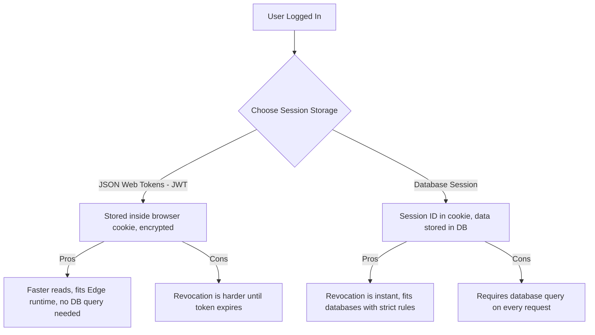

Authentication is a foundational part of modern web applications. In a Next.js App Router project, managing user sessions, OAuth flows, and database integration requires an architecture that can support both server-rendered pages and interactive client interfaces. **Auth.js** (NextAuth v5) is designed for this architecture, providing a unified API for authentication across Edge runtimes and Node.js servers.

---

## Sessions: JWT vs. Database Storage

When setting up auth, one of your first decisions is choosing how to store user sessions:



Auth.js defaults to JWT-based sessions, which is the recommended approach for Next.js projects because it allows session checking to run quickly within Edge middleware without database round trips.

---

## Auth.js v5 Core Configuration

To set up Auth.js v5 in your application, start by creating a configuration file at the root of your project:

```ts
// auth.ts
import NextAuth from 'next-auth';
import GitHub from 'next-auth/providers/github';

export const { handlers, auth, signIn, signOut } = NextAuth({
  providers: [
    GitHub({
      clientId: process.env.AUTH_GITHUB_ID,
      clientSecret: process.env.AUTH_GITHUB_SECRET,
    }),
  ],
  callbacks: {
    // Inject the user role and ID into the JWT token
    async jwt({ token, user }) {
      if (user) {
        token.role = user.role || 'user';
        token.id = user.id;
      }
      return token;
    },
    // Make the user role and ID available in the session object
    async session({ session, token }) {
      if (session.user) {
        session.user.role = token.role;
        session.user.id = token.id as string;
      }
      return session;
    },
  },
  pages: {
    signIn: '/login', // Redirect users to a custom login page
  },
});
```

Next, expose the API endpoints that Auth.js needs to handle login redirects and callbacks:

```ts
// app/api/auth/[...nextauth]/route.ts
import { handlers } from '@/auth';
export const { GET, POST } = handlers;
```

---

## Defining Environment Variables

Store your credentials in `.env.local`:

```bash
# Generate a secure secret using: openssl rand -base64 32
AUTH_SECRET=your-random-32-char-secret

# GitHub OAuth credentials
AUTH_GITHUB_ID=your-github-client-id
AUTH_GITHUB_SECRET=your-github-client-secret
```

---

## Protecting Routes

You can inspect user sessions in three main places in Next.js: Server Components, Middleware, or Server Actions.

### 1. Verification in Server Components
To protect a single page, call the `auth()` function at the top of your component:

```tsx
// app/dashboard/page.tsx
import { auth } from '@/auth';
import { redirect } from 'next/navigation';

export default async function DashboardPage() {
  const session = await auth();

  if (!session) {
    redirect('/login?callbackUrl=/dashboard');
  }

  return (
    <div className="p-8">
      <h1>Welcome back, {session.user?.name}</h1>
      <p>Role: {session.user?.role}</p>
    </div>
  );
}
```

### 2. Bulk Route Protection in Middleware
To protect entire folders, use middleware. This checks the session before rendering the route or loading static files:

```ts
// middleware.ts
import { auth } from '@/auth';
import { NextResponse } from 'next/server';

export default auth((request) => {
  const isLoggedIn = !!request.auth;
  const isDashboard = request.nextUrl.pathname.startsWith('/dashboard');

  if (isDashboard && !isLoggedIn) {
    return NextResponse.redirect(new URL('/login', request.nextUrl));
  }

  return NextResponse.next();
});

export const config = {
  // Run on dashboard and settings, but exclude static assets
  matcher: ['/dashboard/:path*', '/settings/:path*'],
};
```

---

## Adding Credentials Authentication (Email/Password)

If you need a custom email/password authentication system, add the `Credentials` provider to your config. Note that password verification should run in Node.js (not Edge) to ensure you can access encryption libraries:

```ts
// auth.ts (added to providers list)
import Credentials from 'next-auth/providers/credentials';
import { z } from 'zod';
import { db } from '@/lib/db';
import bcrypt from 'bcryptjs';

const LoginSchema = z.object({
  email: z.string().email(),
  password: z.string().min(6),
});

export const { handlers, auth, signIn, signOut } = NextAuth({
  providers: [
    Credentials({
      async authorize(credentials) {
        const parsed = LoginSchema.safeParse(credentials);

        if (!parsed.success) return null;

        const { email, password } = parsed.data;

        // Query user from database
        const user = await db.user.findUnique({ where: { email } });
        if (!user || !user.passwordHash) return null;

        // Check password matching
        const passwordsMatch = await bcrypt.compare(password, user.passwordHash);

        if (passwordsMatch) {
          return { id: user.id, name: user.name, email: user.email, role: user.role };
        }

        return null;
      },
    }),
  ],
});
```

Using this setup, calling login redirects requests directly to your custom `authorize` script, keeping verification logic server-side.

For how auth interacts with edge middleware, see [Next.js Middleware guide](/blog/nextjs-middleware-guide). For server-side mutations that require auth, see [Server Actions](/blog/nextjs-server-actions).

## Related Articles

- [Next.js Middleware: Edge Logic Without a Separate Server](/blog/nextjs-middleware-guide)
- [Server Actions in Next.js: Mutations Without an API Layer](/blog/nextjs-server-actions)
- [How to Build a Full-Stack Application with Next.js](/blog/build-full-stack-nextjs-app)
