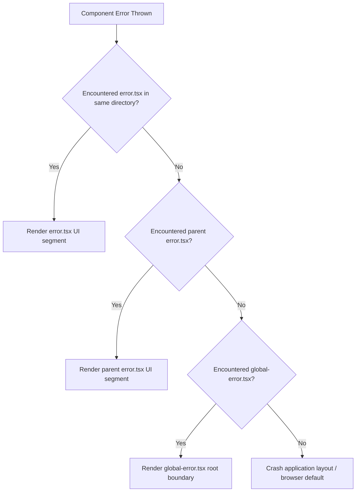

Handling errors in web applications is essential to ensure user retention and prevent runtime crashes. The Next.js App Router implements a layered error handling model, providing built-in file conventions (`error.tsx`, `not-found.tsx`, and `global-error.tsx`) to catch and resolve exceptions at different levels of the component tree.

---

## The Error Propagation Hierarchy

When a component throws an error during rendering, the error bubbles up the React render tree until it encounters a boundary. Next.js maps boundaries automatically based on the presence of special files:



This nested structure allows you to isolate rendering crashes. An error in a sidebar component will only replace the sidebar with an error state, keeping the rest of the application layout functional.

---

## Localized Route Boundaries with `error.tsx`

The `error.tsx` file defines a React error boundary for a specific route segment. It **must be a Client Component** because it needs to intercept and recover from client-side runtime errors.

```tsx
// app/dashboard/error.tsx
'use client';

import { useEffect } from 'react';

interface ErrorProps {
  error: Error & { digest?: string };
  reset: () => void;
}

export default function DashboardError({ error, reset }: ErrorProps) {
  useEffect(() => {
    // Log details to an external monitoring service (e.g. Sentry)
    console.error('Captured dashboard crash:', error);
  }, [error]);

  return (
    <div className="p-6 border border-red-200 rounded-lg bg-red-50/50">
      <h2 className="text-lg font-bold text-red-800">Something went wrong</h2>
      <p className="text-sm text-red-600 mb-4">{error.message}</p>
      
      {error.digest && (
        <p className="text-xs text-gray-500 mb-4">Error Hash: {error.digest}</p>
      )}

      <button
        onClick={() => reset()}
        className="px-4 py-2 bg-red-800 text-white rounded text-sm hover:bg-red-900 transition"
      >
        Try Again
      </button>
    </div>
  );
}
```

### The `reset` Parameter
The `reset()` function attempts to re-render the crashed segment. If the error was caused by a temporary network failure, clicking "Try Again" can restore the page without forcing a full reload.

### The `error.digest` Property
For security reasons, Next.js does not expose raw database query errors or sensitive stack traces to the client in production. Instead, it generates a hash key (`digest`) and logs the detailed error on the server. You can use this hash key to search server log files when debugging issues.

---

## Custom 404 Pages with `not-found.tsx`

If a requested route or database record does not exist, trigger the 404 page by calling the `notFound()` utility function inside your page component:

```tsx
// app/blog/[slug]/page.tsx
import { notFound } from 'next/navigation';
import { getBlogPost } from '@/lib/posts';

export default async function BlogPostPage({ params }: { params: { slug: string } }) {
  const { slug } = await params;
  const post = await getBlogPost(slug);

  if (!post) {
    // Render the nearest not-found.tsx page boundary
    notFound();
  }

  return (
    <article className="max-w-2xl mx-auto p-6">
      <h1>{post.title}</h1>
      <p>{post.content}</p>
    </article>
  );
}
```

Now, define your user-friendly 404 layout:

```tsx
// app/blog/not-found.tsx
import Link from 'next/link';

export default function BlogNotFound() {
  return (
    <div className="text-center py-12">
      <h2 className="text-2xl font-bold text-gray-800 mb-2">Article Not Found</h2>
      <p className="text-gray-600 mb-6">The post you are trying to access does not exist.</p>
      <Link
        href="/blog"
        className="px-4 py-2 bg-blue-600 text-white rounded hover:bg-blue-700 transition"
      >
        Back to Blog Index
      </Link>
    </div>
  );
}
```

---

## Absolute Fallbacks with `global-error.tsx`

A standard `error.tsx` boundary does not catch errors thrown inside the root `app/layout.tsx` file (because the layout wraps the boundary). To handle failures in your main layouts, add a `global-error.tsx` file at the root of your project:

```tsx
// app/global-error.tsx
'use client';

interface GlobalErrorProps {
  error: Error & { digest?: string };
  reset: () => void;
}

export default function GlobalError({ error, reset }: GlobalErrorProps) {
  return (
    <html lang="en">
      <body className="flex flex-col items-center justify-center min-h-screen bg-gray-50">
        <h1 className="text-3xl font-bold text-gray-900 mb-2">System Crash</h1>
        <p className="text-gray-600 mb-6">A critical system error occurred.</p>
        
        <button
          onClick={() => reset()}
          className="px-6 py-3 bg-blue-600 text-white rounded hover:bg-blue-700 transition"
        >
          Attempt Recovery
        </button>
      </body>
    </html>
  );
}
```

**Note:** `global-error.tsx` replaces the active root page shell. Therefore, it must define its own `<html>` and `<body>` tags.

---

## Error Handling inside Server Actions

Because Server Actions are called via forms or React transitions, throwing raw exceptions inside them can crash your components. A better pattern is to return error states safely:

```ts
// app/actions/delete-account.ts
'use server';

import { db } from '@/lib/db';
import { revalidatePath } from 'next/cache';

export async function deleteAccountAction(prevState: any, formData: FormData) {
  const userId = formData.get('userId') as string;

  try {
    // Perform database operations
    await db.user.delete({ where: { id: userId } });
    revalidatePath('/');
    return { success: true, message: 'Account deleted successfully.' };
  } catch (error) {
    // Avoid returning raw errors to prevent database schema leaks
    return {
      success: false,
      message: 'Failed to delete account. Please contact system support.',
    };
  }
}
```

Returning standardized status payloads keeps the boundary clean and lets the calling client handle states gracefully.

For error states during streaming, see [data fetching patterns](/blog/nextjs-data-fetching). For server action error handling, see [Server Actions guide](/blog/nextjs-server-actions).

## Related Articles

- [Data Fetching in Next.js: Patterns for Every Use Case](/blog/nextjs-data-fetching)
- [Server Actions in Next.js: Mutations Without an API Layer](/blog/nextjs-server-actions)
- [Next.js App Router: Everything You Need to Know](/blog/nextjs-app-router-everything)
