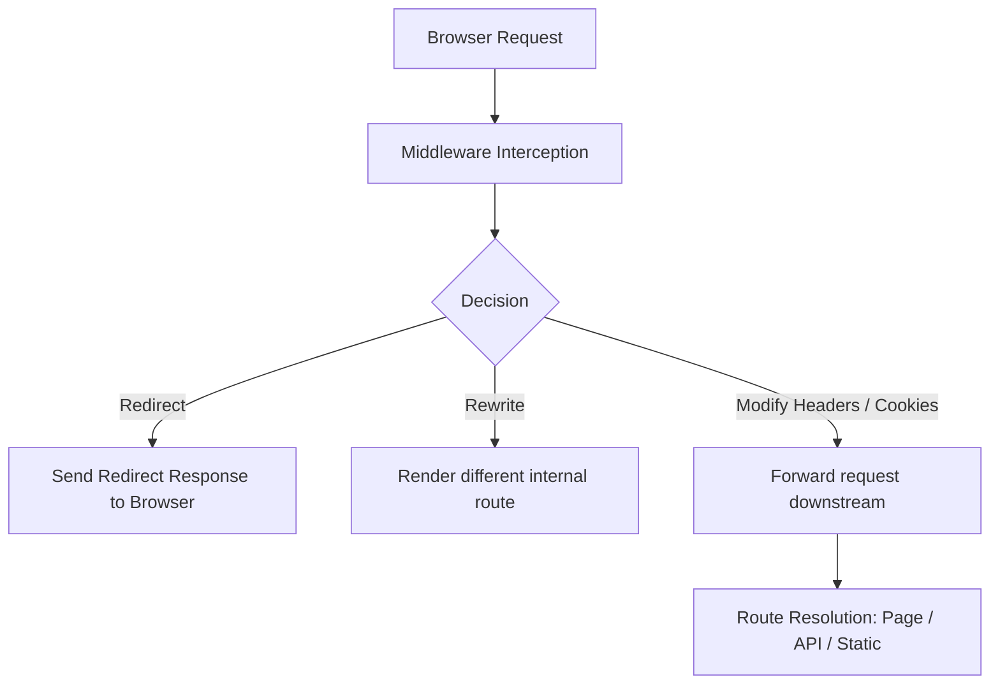

Middleware in Next.js sits between the browser and your pages. It runs on the edge — before the request hits a static file, a server component, or an API route — which means it can make decisions with near-zero latency, regardless of where your user is. For things like redirects, auth checks, A/B testing flags, and geo-based routing, this is exactly where that logic belongs.

## V8 isolates: The execution environment

To write good middleware, you need to understand that it does not run in a standard Node.js environment. It executes inside a lightweight V8 isolate runtime, which is the same technology powering Cloudflare Workers and Vercel Edge Functions. 

Unlike standard Node.js processes that boot a full runtime and consume tens of megabytes of memory, V8 isolates are extremely fast to boot (less than a millisecond) and have a tiny memory footprint. However, this speed comes with strict constraints:
- **No Node.js APIs:** You cannot use core libraries like `fs`, `path`, or `dns`.
- **No native modules:** Any dependency relying on C++ extensions or Node.js native bindings will crash.
- **Strict execution time limit:** Your middleware must return a response within a very tight window (often under 50ms).
- **Bundle size limits:** The compiled middleware bundle must remain small (typically under 1MB) to ensure instant edge deployments.

Understanding these boundaries helps you structure your edge code to be lightweight, avoiding bloated libraries and heavy DB round trips.

## How Middleware Works Under the Hood

When a request arrives at your Next.js application, it flows through a specific pipeline. Middleware runs at the very beginning of this pipeline, intercepting the request before it reaches the routing table.



This sequence explains why middleware is highly efficient: it allows you to reject unauthorized users or serve localized versions of pages without incurring the overhead of full React rendering or server execution.

## Controlling Which Routes Middleware Runs On

By default, middleware runs on every single request, including images, CSS stylesheets, JavaScript chunks, and favicons. Running execution logic on every asset request slows down page loads and consumes execution limits unnecessarily. 

You must define which routes trigger your middleware. Next.js supports two main ways to filter requests: the `config` matcher export and conditional checking within the middleware itself.

### 1. The Matcher Configuration
The matcher allows you to use glob patterns or regular expressions to define paths. The recommended approach is to exclude static assets and internal Next.js folders entirely:

```ts
// middleware.ts
export const config = {
  matcher: [
    /*
     * Match all request paths except for the ones starting with:
     * - api (API routes)
     * - _next/static (static files)
     * - _next/image (image optimization files)
     * - favicon.ico (favicon file)
     */
    '/((?!api|_next/static|_next/image|favicon.ico).*)',
  ],
};
```

### 2. Conditional Checks
If your logic needs to dynamically bypass certain routes (for example, checking query parameters or specific hostnames), use conditional statements inside the main middleware function:

```ts
import { NextResponse } from 'next/server';
import type { NextRequest } from 'next/server';

export function middleware(request: NextRequest) {
  const { pathname } = request.nextUrl;

  // Ignore static assets manually if not using the config matcher
  if (
    pathname.startsWith('/_next') ||
    pathname.includes('.')
  ) {
    return NextResponse.next();
  }

  // Your logic here
  return NextResponse.next();
}
```

---

## Common Patterns and Implementations

### Pattern 1: Auth Protection and Redirect Routing
The most common use case is protecting dashboard routes. Instead of checking authentication in every component or API endpoint, you verify the presence of a token at the edge.

```ts
import { NextResponse } from 'next/server';
import type { NextRequest } from 'next/server';

const PROTECTED_PATHS = ['/dashboard', '/settings', '/billing'];

export function middleware(request: NextRequest) {
  const sessionToken = request.cookies.get('session-token')?.value;
  const isProtected = PROTECTED_PATHS.some((path) =>
    request.nextUrl.pathname.startsWith(path)
  );

  if (isProtected && !sessionToken) {
    const loginUrl = new URL('/login', request.url);
    // Remember the page they tried to visit so we can redirect them back
    loginUrl.searchParams.set('redirect', request.nextUrl.pathname);
    return NextResponse.redirect(loginUrl);
  }

  return NextResponse.next();
}
```

### Pattern 2: Multi-variant Testing (A/B Testing)
A/B testing is usually slow when done on the client because it causes layout shifts. With edge middleware, you can read or assign a cohort cookie, and instantly rewrite the request to the corresponding variation without any layout shifts.

```ts
import { NextResponse } from 'next/server';
import type { NextRequest } from 'next/server';

export function middleware(request: NextRequest) {
  const { pathname } = request.nextUrl;
  
  if (pathname === '/landing-page') {
    let bucket = request.cookies.get('ab-cohort')?.value;

    if (!bucket) {
      // Assign bucket randomly: 50% Control (A), 50% Variation (B)
      bucket = Math.random() < 0.5 ? 'cohort-a' : 'cohort-b';
    }

    const response = NextResponse.rewrite(
      new URL(`/landing-page/${bucket}`, request.url)
    );

    // Persist the bucket so the user has a consistent experience
    response.cookies.set('ab-cohort', bucket, { maxAge: 60 * 60 * 24 * 30 }); // 30 days
    return response;
  }

  return NextResponse.next();
}
```

### Pattern 3: Geo-Personalization (Localization)
If you deploy on Vercel, the platform injects regional headers into the incoming request. You can use these headers to adapt your application's behavior before rendering:

```ts
import { NextResponse } from 'next/server';
import type { NextRequest } from 'next/server';

export function middleware(request: NextRequest) {
  const country = request.headers.get('x-vercel-ip-country') || 'US';
  const response = NextResponse.next();

  // Inject the country header down to server components
  response.headers.set('x-user-country', country);

  // If the user visits a generic URL, localized pages can be served
  if (request.nextUrl.pathname === '/store') {
    if (country === 'FR') {
      return NextResponse.rewrite(new URL('/store/fr', request.url));
    }
  }

  return response;
}
```

---

## Production Best Practices

To avoid performance degradation in production, follow these key guidelines:

1. **Avoid Heavy Cryptography:** Native Web Crypto is supported, but complex operations (like full asymmetric token verification) will add latency to every request. Prefer lightweight token checks (like checking cookie signatures or basic structure verification) and defer thorough database checks to downstream APIs.
2. **Minimize Network Requests:** Avoid making external fetch calls inside middleware. Each external call adds network latency. If you must call an external API (e.g., config server or feature flag provider), implement aggressive caching using in-memory or edge-cached stores.
3. **Use Rewrites Instead of Redirects for Internal Navigation:** Instead of sending an HTTP redirect status (like `307`) which forces the browser to make a new HTTP request, use `NextResponse.rewrite` to serve the page content silently. This keeps the URL clean and is twice as fast.

For a deeper look at the routing system middleware integrates with, see the [App Router guide](/blog/nextjs-app-router-everything). For how middleware fits into a performance-first architecture, see [Next.js performance tips](/blog/nextjs-performance-tips).

## Related Articles

- [Next.js App Router: Everything You Need to Know](/blog/nextjs-app-router-everything)
- [Next.js Image Optimization: Getting the Most Out of next/image](/blog/nextjs-image-optimization)
- [Next.js Performance Tips: What Actually Moves the Needle](/blog/nextjs-performance-tips)
