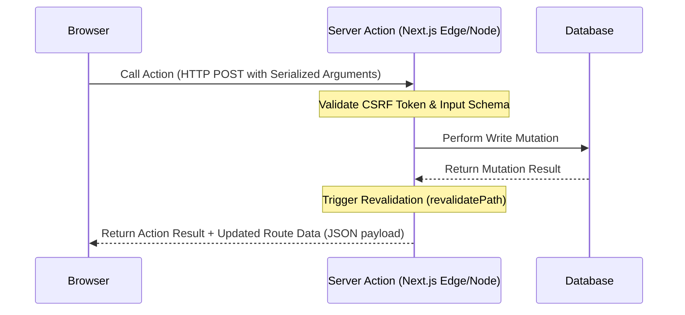

Server Actions are asynchronous functions that execute directly on the server, but can be invoked from client-side React components as if they were local functions. They remove the boilerplate of writing API routes, setting up fetch handlers, and managing manual loading states for data mutations.

## How Server Actions Work Under the Hood

When you export a function with the `'use server'` directive, Next.js does not send that function's code to the browser. Instead, it extracts the code, sets up an internal POST endpoint, and replaces your function import with a lightweight client-side wrapper.



This request is sent as an HTTP `POST` to the current page URL with a custom header `Next-Action` containing a secure, non-guessable build hash of the action.

---

## Form Handling and Schema Validation

When a user submits a form, the input fields are sent as a standard `FormData` object. To prevent bad data from reaching your database, use a validation library like **Zod** directly inside your action.

Here is a full example showing schema parsing and error handling:

```ts
// app/actions/create-post.ts
'use server';

import { z } from 'zod';
import { db } from '@/lib/db';
import { revalidatePath } from 'next/cache';

const PostSchema = z.object({
  title: z.string().min(3, 'Title must be at least 3 characters long'),
  content: z.string().min(10, 'Content must be at least 10 characters long'),
});

export async function createBlogPost(prevState: any, formData: FormData) {
  // Validate form inputs
  const result = PostSchema.safeParse({
    title: formData.get('title'),
    content: formData.get('content'),
  });

  if (!result.success) {
    return {
      success: false,
      errors: result.error.flatten().fieldErrors,
    };
  }

  const { title, content } = result.data;

  try {
    await db.post.create({
      data: { title, content },
    });

    // Invalidate the cache for the blog index page
    revalidatePath('/blog');

    return { success: true, errors: {} };
  } catch (error) {
    return {
      success: false,
      errors: { _form: ['Failed to save post to the database.'] },
    };
  }
}
```

---

## Form State and Pending Status with React Hooks

To display validation feedback and loading indicators, connect your form using React's **`useActionState`** (historically `useFormState`) and **`useFormStatus`** hooks.

### 1. The Main Form Component
The `useActionState` hook tracks the response returned by your action, along with a loading indicator.

```tsx
// app/blog/new/NewPostForm.tsx
'use client';

import { useActionState } from 'react';
import { createBlogPost } from '@/app/actions/create-post';
import FormSubmitButton from './FormSubmitButton';

const initialState = { success: false, errors: {} };

export default function NewPostForm() {
  const [state, formAction] = useActionState(createBlogPost, initialState);

  return (
    <form action={formAction} className="space-y-4 max-w-md">
      <div>
        <label className="block text-sm font-medium">Title</label>
        <input name="title" type="text" className="border p-2 w-full rounded" />
        {state.errors?.title && (
          <p className="text-red-500 text-xs mt-1">{state.errors.title[0]}</p>
        )}
      </div>

      <div>
        <label className="block text-sm font-medium">Content</label>
        <textarea name="content" className="border p-2 w-full rounded h-32" />
        {state.errors?.content && (
          <p className="text-red-500 text-xs mt-1">{state.errors.content[0]}</p>
        )}
      </div>

      {state.errors?._form && (
        <p className="text-red-500 text-sm">{state.errors._form[0]}</p>
      )}

      <FormSubmitButton />
    </form>
  );
}
```

### 2. Displaying Pending Status
The `useFormStatus` hook can check if the parent form is currently sending a request. Because it reads status from context, it **must be used in a child component** of the `<form>`:

```tsx
// app/blog/new/FormSubmitButton.tsx
'use client';

import { useFormStatus } from 'react-dom';

export default function FormSubmitButton() {
  const { pending } = useFormStatus();

  return (
    <button
      type="submit"
      disabled={pending}
      className="bg-blue-600 text-white p-2 rounded disabled:bg-gray-400"
    >
      {pending ? 'Saving Post...' : 'Create Post'}
    </button>
  );
}
```

---

## Optimistic Updates for Fast UI Transitions

For user-driven elements like Likes, Bookmarks, or Cart Counters, waiting for the server response before updating the UI can feel slow. The `useOptimistic` hook lets you update the UI instantly, automatically rolling back if the server action fails.

Here is how you write a self-contained, optimistic Like Button component:

```tsx
// components/LikeButton.tsx
'use client';

import { useOptimistic, useTransition } from 'react';
import { toggleLikeAction } from '@/app/actions/toggle-like';

interface Props {
  postId: string;
  initialLikeCount: number;
  initialIsLiked: boolean;
}

export default function LikeButton({ postId, initialLikeCount, initialIsLiked }: Props) {
  const [isPending, startTransition] = useTransition();

  // Define optimistic state mapping
  const [optimisticState, setOptimisticState] = useOptimistic(
    { count: initialLikeCount, liked: initialIsLiked },
    (state, newLiked: boolean) => ({
      count: newLiked ? state.count + 1 : state.count - 1,
      liked: newLiked,
    })
  );

  const handleLike = () => {
    startTransition(async () => {
      // 1. Instantly toggle the UI state
      setOptimisticState(!optimisticState.liked);
      
      // 2. Perform the actual write mutation
      try {
        await toggleLikeAction(postId);
      } catch (err) {
        console.error('Failed to update like status', err);
      }
    });
  };

  return (
    <button
      onClick={handleLike}
      disabled={isPending}
      className={`p-2 rounded border transition ${
        optimisticState.liked ? 'bg-red-500 text-white' : 'bg-transparent text-gray-700'
      }`}
    >
      {optimisticState.liked ? '❤️' : '🤍'} Like ({optimisticState.count})
    </button>
  );
}
```

---

## Security Guidelines for Server Actions

Because Server Actions behave like internal functions, it is easy to forget that they are publicly accessible HTTP endpoints. Always implement these checks:

1. **Verify Authorization:** Always check user credentials inside the action. Never trust variables passed directly from the client (like a user ID) without server-side validation.
2. **Implement Input Validation:** Use libraries like Zod to parse parameters. Do not write inputs directly to SQL or NoSQL databases.
3. **Use Anti-CSRF Protection:** Next.js implements CSRF protection automatically for Server Actions, checking matching origins before executing mutations.

For how server actions fit into a full-stack architecture, see [building a full-stack Next.js app](/blog/build-full-stack-nextjs-app). For data-fetching patterns (reading side), see [Next.js data fetching](/blog/nextjs-data-fetching).

## Related Articles

- [How to Build a Full-Stack Application with Next.js](/blog/build-full-stack-nextjs-app)
- [Data Fetching in Next.js: Patterns for Every Use Case](/blog/nextjs-data-fetching)
- [Next.js App Router: Everything You Need to Know](/blog/nextjs-app-router-everything)
