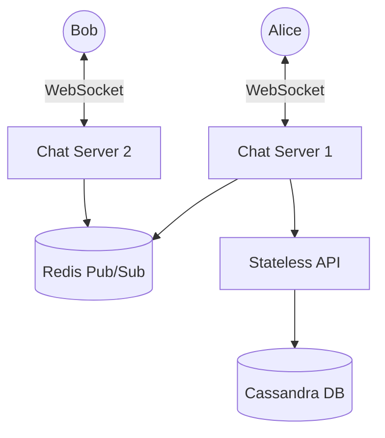

Designing a real-time chat application (like WhatsApp, Messenger, or Discord) is a complex challenge that forces you to move away from standard HTTP Request-Response models into the world of persistent connections and real-time state management.

---

## 1. The Protocol: Why not HTTP?

In a standard web app, the Client initiates a request, and the Server responds. But in a chat app, if Alice sends a message to Bob, the server needs to actively "push" that message to Bob's phone. Bob cannot constantly ask the server, "Do I have a new message?" every single second — this technique (HTTP Long Polling) drains battery life and overwhelms the server with empty requests.

### The Solution: WebSockets
WebSockets provide a **persistent, bi-directional, full-duplex TCP connection** between the client and the server.
- The connection is established once (via an HTTP Upgrade handshake).
- Once connected, both the client and the server can send data to each other instantly, with almost zero overhead.
- This is the foundation of every modern real-time application.

---

## 2. High-Level Architecture

Handling 100 million active WebSocket connections requires a specialized architecture. You cannot terminate all these connections on a standard monolithic API server.

### The Chat Servers (Stateful)
Chat servers hold thousands of open WebSocket connections. They are **stateful** because Server 1 intrinsically "knows" that Alice's TCP socket is connected to it. 
When Alice connects, her routing information (`UserID: Alice -> ServerID: CS1`) is saved in a central Redis cache.

### The Message Flow
1. Alice sends a message intended for Bob via her WebSocket to **Chat Server 1**.
2. **Chat Server 1** accepts the message and queries the central Redis cache: *"Which server is Bob connected to?"*
3. Redis replies: *"Bob is connected to Chat Server 2."*
4. **Chat Server 1** publishes the message over an internal message bus (like Redis Pub/Sub or Kafka) to **Chat Server 2**.
5. **Chat Server 2** receives the internal payload, finds Bob's open WebSocket, and pushes the message to Bob's phone.

---

## 3. Storage and Message History

Users expect to see their chat history instantly when they buy a new phone. This requires storing billions of small messages.

### The Database Choice
Chat data is unique:
- **Massive Write Volume:** Millions of messages are written per second.
- **Recent Read Bias:** Users only read recent messages. Messages older than a few weeks are almost never accessed.
- **Key-Value Access Pattern:** We query messages specifically by `ChatID`.

**Apache Cassandra** or **Amazon DynamoDB** (Wide-Column / Key-Value NoSQL databases) are perfectly suited for this. They offer extreme write throughput, linear scalability, and constant-time lookups for specific Chat IDs.

### Handling Message Ordering
In a distributed system, relying on standard timestamps to order messages is dangerous because server clocks drift (NTP drift). Two servers might disagree on what time it is by a few milliseconds.
To guarantee perfect ordering in a 1-on-1 chat, we can use a **local sequence number** generator for each specific Chat ID, ensuring messages are strictly ordered regardless of global system time.

---

## 4. Online Presence (The Green Dot)

Showing whether a user is "Online" or "Offline" seems simple, but it is one of the most resource-intensive features of a chat system. 

If you have 10 million online users, and a user goes offline, you have to notify all their friends. This creates a massive Fan-out problem.

### The Heartbeat Mechanism
Because mobile internet connections drop constantly (driving through a tunnel), a dropped TCP connection doesn't necessarily mean the user intentionally went offline.
- The client sends a tiny "Heartbeat" ping to the Presence Server every 5 seconds.
- The Presence Server updates a `last_active_at` timestamp in Redis.
- If the Presence Server hasn't received a heartbeat from a user in 30 seconds, it officially marks them as "Offline" and broadcasts this status to their friends via the Message Bus.

### Scaling Presence for Group Chats (Discord/Slack)
If a Discord server has 100,000 members, broadcasting an "Online" status to 99,999 other people every time someone opens the app would destroy the network.
Instead of real-time push, large group chats use a **Lazy Pull Strategy**. When a user opens the Discord app, they fetch the online status of the group members once. Subsequent updates are batched or only requested when the user actively interacts with the member list.

---

## 5. End-to-End Encryption (E2EE)

In modern systems like WhatsApp or Signal, the server **never** sees the plaintext message.
1. When Alice installs the app, she generates a Public/Private key pair locally on her device. She uploads the Public Key to the server.
2. When Alice wants to message Bob, she fetches Bob's Public Key from the server.
3. Alice encrypts the message locally using Bob's Public Key.
4. The encrypted cipher is sent through the Chat Servers and stored in Cassandra.
5. Bob receives the cipher and decrypts it locally using his Private Key (which never leaves his phone).

Even if the Cassandra database is hacked, the attacker only gets mathematically unbreakable ciphertext.

## Related Articles
- [Designing a Notification System](/blog/sysdesign-notification-system)
- [Distributed Key-Value Store Architecture](/blog/sysdesign-key-value-store)
