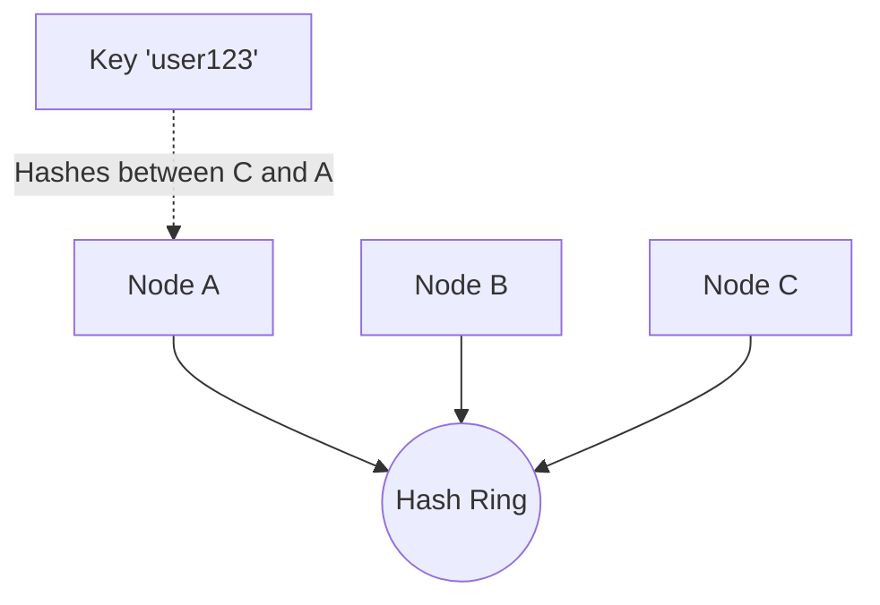

A Distributed Key-Value store (like Amazon DynamoDB, Apache Cassandra, or Riak) is a highly scalable NoSQL database designed to store massive amounts of unstructured data across thousands of servers. 

When a standard relational database (like PostgreSQL) outgrows a single machine, partitioning the data becomes extremely complex due to strict ACID guarantees. Distributed Key-Value stores intentionally sacrifice some consistency to guarantee perfect horizontal scalability and ultimate availability.

---

## 1. The CAP Theorem

The foundation of distributed database design is the **CAP Theorem**, which states that a distributed data store can only provide two of the following three guarantees simultaneously:

1. **Consistency (C):** Every read receives the most recent write, or an error.
2. **Availability (A):** Every request receives a non-error response, without the guarantee that it contains the most recent write.
3. **Partition Tolerance (P):** The system continues to operate despite an arbitrary number of messages being dropped by the network between nodes.

Because network partitions (P) are a physical reality (cables get cut, switches fail), all distributed systems **must** tolerate partitions. Therefore, you must choose between **CP** (Consistency) or **AP** (Availability).

Most distributed Key-Value stores are **AP Systems**. They prioritize keeping the database online and accepting writes, even if it means some nodes temporarily return stale data (Eventual Consistency).

---

## 2. Data Partitioning: Consistent Hashing

If we have 1 Terabyte of data and 4 database servers (Nodes), we need a way to evenly distribute the data. A naive approach is to use the modulo operator:
`Node = Hash(Key) % 4`

**The Problem:** If we add a 5th node to handle more traffic, the formula changes to `Hash(Key) % 5`. This completely breaks the mapping. We would have to physically move 80% of our 1 Terabyte of data to new nodes just to rebalance the cluster. This massive data migration would take the database offline.

### The Solution: Consistent Hashing
Instead of using modulo arithmetic, Consistent Hashing maps both the Data Keys and the Node IPs onto a circular "Hash Ring" (from $0$ to $2^{160}-1$).

- To find where a key is stored, we hash the key, land on the ring, and walk clockwise until we hit the first Node.
- If we add a new Node, we simply place it on the ring. Only the data immediately counter-clockwise to the new node is moved. **Only $1/N$ of the data needs to be remapped**, making scaling incredibly fast and seamless.

To ensure perfect distribution, each physical Node is mapped to multiple "Virtual Nodes" on the ring.

---

## 3. Data Replication

To achieve high availability, we cannot store a piece of data on just one node. If that node burns down in a datacenter fire, the data is lost forever.

Data is replicated asynchronously across $N$ nodes (where $N$ is the replication factor, typically 3). Using our Consistent Hashing ring, when a Key lands on Node A, it is also replicated to the next two distinct nodes on the ring (Node B and Node C). 

If Node A dies, Node B immediately steps in to serve the data.

---

## 4. Consistency vs. Latency (The Quorum)

Because data is replicated across 3 nodes, what happens if Node A receives a write, but Node C hasn't synced the data yet when a read request arrives? 

DynamoDB manages this using a **Quorum** system, configurable by the client:
- $N =$ Replication Factor
- $W =$ Write Quorum (Nodes that must acknowledge a write for it to succeed)
- $R =$ Read Quorum (Nodes that must be queried during a read)

**The Consistency Rule:** If $W + R > N$, you are guaranteed Strong Consistency because the read and write nodes will always overlap.

- **Fast (Eventual) Consistency:** $W=1, R=1$. Extremely low latency, but high risk of reading stale data.
- **Strong Consistency:** $W=2, R=2$. Slower, because the coordinator must wait for multiple nodes over the network, but perfectly accurate.

---

## 5. Resolving Conflicts: Vector Clocks

In an AP system, if a network partitions, Node A and Node C might both accept writes for the exact same key from different clients simultaneously. When the network heals, we have a massive problem: which version of the data is the correct one?

Dynamo uses **Vector Clocks** to detect causality. A Vector Clock is a list of `[Server, Version]` pairs attached to the data.

1. Client writes `Name="Alice"`. Handled by Node 1. Clock: `[N1: 1]`
2. Client updates `Name="Alice Smith"`. Handled by Node 1. Clock: `[N1: 2]`
3. Network splits!
4. Client updates `Name="Alice Jones"`. Handled by Node 2. Clock: `[N1:2, N2:1]`
5. Client updates `Name="Alice Lee"`. Handled by Node 3. Clock: `[N1:2, N3:1]`

When the network heals, Node 2 and Node 3 attempt to sync. They compare their vector clocks. Because neither clock is an ancestor of the other, a **Conflict** is declared. The database cannot mathematically resolve this, so it returns *both* versions to the Client on the next read request, forcing the application layer to resolve the conflict (e.g., merging Amazon Shopping Carts).

---

## 6. Failure Detection: Gossip Protocol

How do nodes know if another node has died? In a 10,000 node cluster, you cannot have a central monitor (it would be a single point of failure).

Nodes use a decentralized **Gossip Protocol**.
Every second, Node A picks a random node (Node B) and whispers: *"Here is my list of who I think is alive and dead."* Node B merges this list with its own and picks a new random node to whisper to. 

Like a virus, information about a dead node propagates through the entire 10,000 node cluster in a matter of seconds, without any central coordination.

## Related Articles
- [Designing a URL Shortener](/blog/sysdesign-url-shortener)
- [Distributed Cache Architecture](/blog/sysdesign-distributed-cache)
