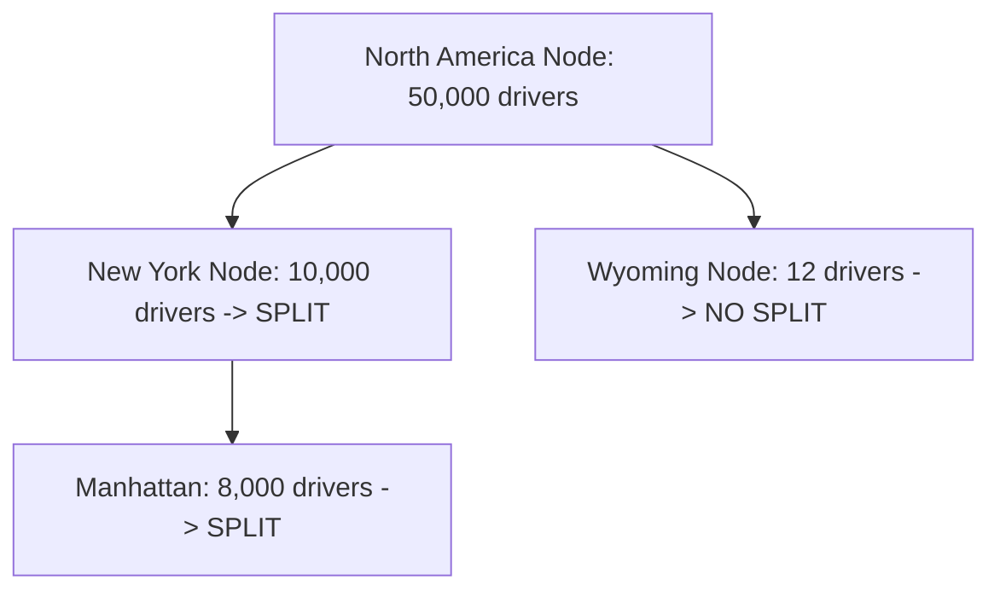

A Location-Based Service (LBS) answers one fundamental question: *"Find me all objects within an X-mile radius of my current GPS coordinates."* 

This is the architectural foundation of Yelp (find nearby restaurants), Tinder (find nearby people), and Uber (find nearby drivers).

---

## 1. The Core Problem: Why SQL Fails

A naive approach to finding nearby drivers is to store their exact Latitude and Longitude in a SQL database:

```sql
SELECT driver_id FROM Drivers 
WHERE lat BETWEEN (my_lat - radius) AND (my_lat + radius)
  AND lon BETWEEN (my_lon - radius) AND (my_lon + radius);
```

**Why this fails at scale:**
Even if you index the `lat` and `lon` columns separately, SQL databases can only use one index per query efficiently. The database will fetch millions of drivers within the Latitude range, and then linearly scan all of them to filter out the Longitude range. This causes massive latency and cannot scale to millions of moving drivers.

We need to map 2D geospatial coordinates (Lat/Lon) into a 1D string or integer so we can use a single, ultra-fast database index.

---

## 2. Geospatial Indexing: Geohashing

Geohashing is a mathematical algorithm that converts a 2D location into a short 1D string (e.g., `9q8yy`).

1. It divides the entire Earth map into 4 quadrants. 
2. It assigns a binary prefix to each quadrant.
3. It recursively divides each quadrant into 4 smaller quadrants, adding to the binary prefix.
4. The final binary string is encoded into Base32.

**The Magic Property of Geohashing:** 
If two locations share the same Geohash prefix (e.g., `9q8yy1` and `9q8yy5`), they are physically close to each other on the map! 

To find all nearby drivers, the server simply calculates the Geohash of your current location (e.g., `9q8yy`), and runs a lightning-fast string prefix query against the database:
`SELECT driver_id FROM Drivers WHERE geohash LIKE '9q8yy%'`

---

## 3. Geospatial Indexing: Quadtrees

While Geohashing is great, it has a problem: densely populated areas (like Manhattan) might have 50,000 drivers in a single Geohash grid, while rural areas (like Wyoming) might have 0 drivers in a grid of the exact same physical size.

A **Quadtree** solves this by dynamically adapting to population density.
- A Quadtree is an in-memory tree data structure.
- If a grid on the map contains more than 100 drivers, the node splits itself into 4 smaller sub-grids (child nodes).
- If a grid is empty, it does not split.



When a user in Manhattan requests a ride, the system traverses the Quadtree in memory down to the Manhattan node and instantly returns the drivers inside it. Quadtrees are stored entirely in RAM (often custom C++ or Go servers) because they must be traversed in microseconds.

---

## 4. Uber vs. Yelp: Real-Time vs. Static

While Uber and Yelp both use geospatial indexing, their write patterns dictate vastly different architectures.

### Yelp (Static Proximity Service)
- **Traffic:** Massive Reads, almost Zero Writes (restaurants don't move).
- **Architecture:** The Quadtree or Geohash index can be computed once, stored in a standard database (like PostgreSQL with the PostGIS extension), and heavily cached in Redis.

### Uber (Real-Time Proximity Service)
- **Traffic:** Massive Writes. Millions of drivers update their GPS coordinates every 3 seconds.
- **Architecture:** Updating a database and rebuilding a Quadtree every 3 seconds will completely melt the servers. 
- **The Solution:** Uber splits the system. A lightweight **Location Tracker Service** receives the millions of GPS pings and stores the raw data directly in a fast in-memory Redis cluster. A separate **Quadtree Worker** asynchronously reads this data every few seconds and gently updates the Quadtree in the background without blocking incoming requests.

---

## 5. WebSockets for Real-Time Tracking

Once an Uber driver accepts your ride, you see their car moving on your screen in real time. 
This is not achieved by the Uber app constantly querying the database. Instead, a **WebSocket** connection is established between your phone and a Dispatch Server. The driver's app publishes its coordinates to a Pub/Sub queue, which pushes the data down the WebSocket directly to your screen with millisecond latency.

## Related Articles
- [Designing a Chat System (WebSockets)](/blog/sysdesign-chat-system)
- [Distributed Key-Value Store Architecture](/blog/sysdesign-key-value-store)
