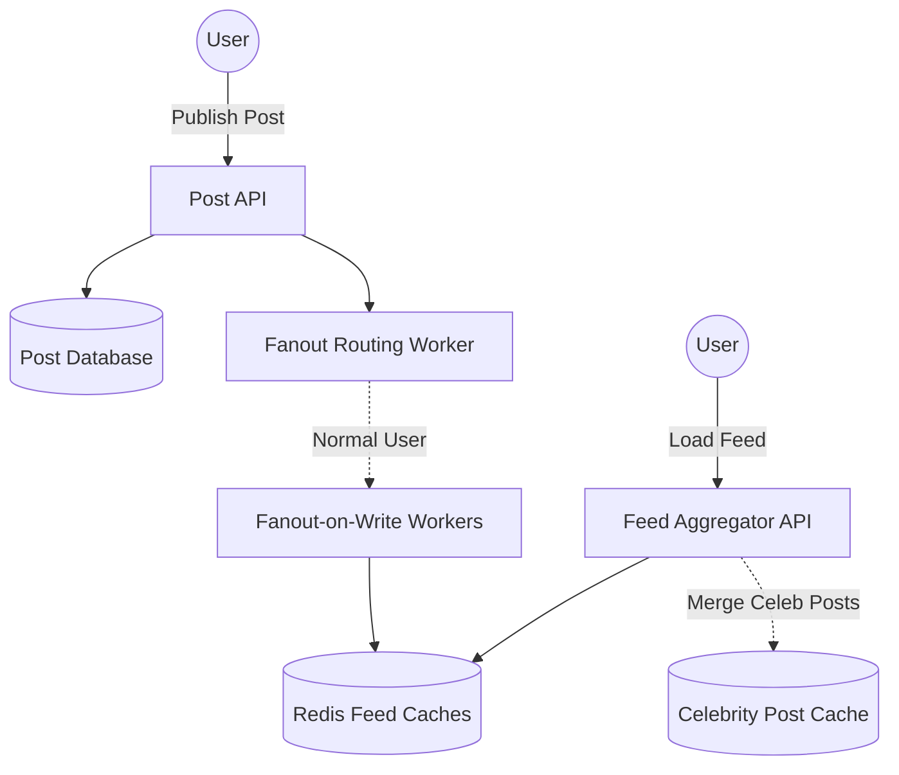

Designing a News Feed (like Twitter's timeline, Instagram's feed, or Facebook's homepage) is one of the most famous system design questions. 

The core challenge: When you open your app, the system must instantly aggregate the most recent posts from the hundreds of people you follow, sort them, and serve them to you in under 200 milliseconds. Doing this dynamically by querying a SQL database for billions of relationships on the fly is impossible.

---

## 1. The Core Architecture: The Fanout Process

"Fanout" is the process of delivering a newly created post to all the followers of the author. There are two entirely different mathematical approaches to solving this problem.

### Approach 1: Fanout-on-Write (Push Model)
When Alice publishes a new tweet, the system immediately pre-computes the news feed for all of her followers. 
- The system fetches Alice's follower list.
- It iterates through the list, and *pushes* the Tweet ID into the pre-computed "Feed Cache" (a Redis List) for every single follower.
- When Bob (a follower) opens his app, the system just reads his Redis Feed Cache in $O(1)$ time.

**Pros:** Reading the feed is blisteringly fast because the feed is already pre-generated.
**Cons:** The "Celebrity Problem". If Justin Bieber (100 million followers) tweets, the system has to perform 100 million database writes instantly. This will crash the worker queues and cause massive delays.

### Approach 2: Fanout-on-Read (Pull Model)
When Alice publishes a tweet, the system simply saves it to her personal database table. Nothing is pushed.
- When Bob opens his app, the system fetches his entire "Following" list (e.g., 500 people).
- It queries the database for the 5 most recent tweets from *each* of those 500 people.
- It aggregates those 2,500 tweets, sorts them by timestamp in memory, and serves the top 20 to Bob.

**Pros:** No massive write spikes when a celebrity tweets. Data is rarely duplicated.
**Cons:** Reading the feed is agonizingly slow. Computing this massive join/aggregation on the fly for every user causes unacceptable latency.

---

## 2. The Solution: The Hybrid Fanout Model

Modern systems (like Twitter) use a Hybrid approach to get the best of both worlds.

1. **For Normal Users (Push):** If an average user with 300 followers tweets, we use **Fanout-on-Write**. The tweet is instantly pushed into the 300 followers' Redis feed caches.
2. **For Celebrities (Pull):** If a user has over 100,000 followers, they are marked as a "Celebrity". When they tweet, the tweet is *only* saved to their personal timeline. It is **not** pushed to anyone.
3. **The Merge at Read Time:** When Bob opens his app, the system quickly pulls his pre-computed feed from Redis (which contains posts from his normal friends). Then, it checks if Bob follows any Celebrities. If yes, it quickly pulls the latest tweets directly from the Celebrities' personal timelines, merges them with the Redis feed in memory, and serves the result.

This perfectly balances Write latency and Read latency!

---

## 3. High-Level Data Flow

### Feed Storage (Redis)
Because feeds must be accessed in milliseconds, the pre-computed feeds are stored entirely in RAM using **Redis**. Specifically, we use a Redis `Sorted Set` (or a capped List) where the Key is the `User_ID`, the Value is the `Post_ID`, and the Score is the `Timestamp`.
We cap the list at ~1,000 posts. Very few users scroll past 1,000 posts in a single sitting. If they do, the system falls back to a slow database query.

---

## 4. Serving Media: CDNs

A news feed isn't just text; it contains Gigabytes of images and videos. Serving these directly from the API servers would instantly saturate the datacenter's network bandwidth.

All images and videos are uploaded to a blob storage service (like Amazon S3). However, S3 is too slow for global delivery. We place a **Content Delivery Network (CDN)** like Cloudflare or Akamai in front of S3. 

When a user in Tokyo opens their feed, the images are served from a CDN edge server physically located in Tokyo, not from the primary database in Virginia. This reduces media loading times from 500ms down to 15ms.

## Related Articles
- [Designing a Notification System](/blog/sysdesign-notification-system)
- [Distributed Key-Value Store Architecture](/blog/sysdesign-key-value-store)
- [Designing a Video Streaming System](/blog/sysdesign-video-streaming)
