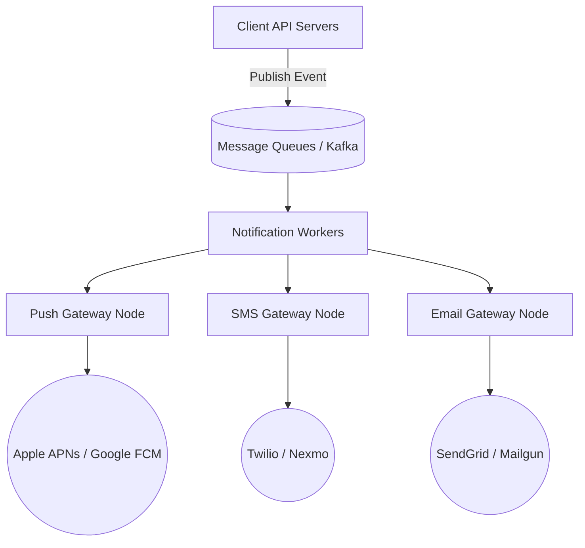

A modern Notification System is responsible for delivering millions of alerts to users via three distinct channels: **Push Notifications** (iOS/Android), **SMS Text Messages**, and **Emails**.

While sending a single email is trivial, designing a system that can send 10 million breaking news push notifications within 30 seconds without dropping messages or spamming users is a massive distributed systems challenge.

---

## 1. High-Level Architecture: Asynchronous Decoupling

If a user likes your post, the API server cannot synchronously connect to the Apple Push Notification Service (APNs), wait for a response, and then return a success message to the liker. The latency would be unacceptable. 

We must decouple the system using **Message Queues**.

### The Worker Pipeline
1. The Core API publishes a generic `Notification_Event` to a Kafka or RabbitMQ queue.
2. A fleet of stateless Notification Workers continuously polls the queue.
3. The worker queries the User Database to fetch the recipient's preferences (e.g., "Did they mute this thread?", "What is their Device Token?").
4. The worker formats the payload and forwards it to the specific Gateway Node (Push, SMS, or Email).
5. The Gateway Node interacts with the actual Third-Party providers (APNs, Twilio, SendGrid).

---

## 2. Handling Third-Party Failures

We rely heavily on external providers like Twilio and APNs. If Twilio goes down for 5 minutes, our system must not lose the user's SMS messages.

### The Retry Queue
If a third-party gateway returns an HTTP 500 error, the worker does not simply discard the message. It places the message into a **Delayed Retry Queue**.
The system will attempt to resend the message using an **Exponential Backoff** algorithm (wait 1 minute, then 5 minutes, then 15 minutes) to avoid hammering a recovering third-party server. If it fails after 5 retries, the message is finally sent to a Dead Letter Queue (DLQ) for manual developer inspection.

---

## 3. Rate Limiting and Deduplication

Users hate spam. If a popular celebrity receives 10,000 likes in one minute, their phone will freeze if we send 10,000 push notifications.

### 1. User-Level Rate Limiting
The Notification Workers check a Redis Rate Limiter before sending. We can enforce rules like: "Maximum 5 push notifications per user, per hour." If the limit is reached, subsequent low-priority notifications are silently dropped.

### 2. Idempotency (Preventing Duplicate Messages)
Because message queues guarantee "At Least Once" delivery (not "Exactly Once"), a network hiccup might cause a worker to process the exact same message twice.
To prevent the user from receiving two identical SMS texts, the worker generates a unique `Event_ID`. Before sending, it checks a Redis Cache to see if `Event_ID` was sent in the last 24 hours. If yes, the duplicate is dropped. This mathematical property is called **Idempotency**.

---

## 4. Analytics and Tracking

Sending the notification is only half the battle. Product managers need to know if the notification was actually clicked.

When formatting the payload, the worker injects tracking pixels into Emails, or deep-link UTM parameters into Push Notifications. When the user clicks the notification, the app sends a tracking event to a separate Analytics Data Pipeline (often dumping massive amounts of JSON logs into an Amazon S3 Data Lake for querying via Athena or Snowflake).

## Related Articles
- [Designing an API Rate Limiter](/blog/sysdesign-rate-limiter)
- [Designing a Chat System](/blog/sysdesign-chat-system)
