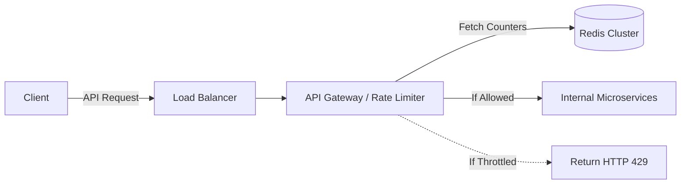

An API Rate Limiter is a critical defensive component that controls the rate of traffic sent by a client or service. It prevents Denial of Service (DoS) attacks, stops cascading failures caused by rogue scripts, and enforces pricing tiers (e.g., Free Tier: 100 requests/day, Pro Tier: 10,000 requests/day).

---

## 1. Core Rate Limiting Algorithms

When designing a rate limiter, the interviewer will expect you to compare the mathematical algorithms that actually measure the traffic.

### The Token Bucket Algorithm
This is the industry standard (used by Amazon, Stripe, and Shopify) due to its memory efficiency and ability to allow short bursts of traffic.

- A bucket is assigned to each user/IP with a maximum capacity of `C` tokens.
- Tokens are automatically refilled into the bucket at a constant rate `R` per second.
- When a request arrives, the system checks if the bucket has at least 1 token.
- If yes, a token is consumed, and the request is processed.
- If no (bucket is empty), the request is dropped (HTTP 429 Too Many Requests).

```text
Capacity: 5 Tokens | Refill Rate: 1 Token/second

[ o o o ] -> User makes 3 concurrent requests -> 3 tokens consumed.
[ _ _ _ ] -> Bucket has 2 tokens left.
(1 second passes)
[ o _ _ ] -> Refiller adds 1 token. Bucket has 3 tokens left.
```
**Pros:** Easy to implement, memory efficient, allows sudden traffic bursts.
**Cons:** Tuning the capacity and refill rate for varying microservices can be difficult.

### The Leaky Bucket Algorithm
Instead of holding tokens, the bucket holds the actual *requests* in a FIFO Queue.
- Requests arrive and are placed at the top of the bucket.
- If the bucket is full, new requests overflow and are discarded.
- Requests "leak" out of the bottom of the bucket at a constant, fixed rate and are processed by the server.

**Pros:** Smooths out traffic into a perfectly stable outflow rate (great for protecting fragile legacy databases).
**Cons:** If a huge burst of traffic arrives, it fills the queue with old requests, and all new requests are discarded until the queue slowly clears out.

### Sliding Window Log
Tracks the exact timestamp of every single request in a Redis Sorted Set.
- Removes timestamps older than the current window (e.g., older than 1 minute).
- If the size of the set is less than the limit, allow the request.
**Pros:** Perfectly accurate. No boundary edge-case issues.
**Cons:** Astronomically high memory footprint. Storing millions of precise timestamps for millions of users destroys RAM.

---

## 2. High-Level Architecture

The rate limiter must sit in front of the actual API servers, usually integrated directly into the **API Gateway** or deployed as a dedicated middleware cluster.



Where do we store the counters? 
Using a relational database (SQL) is far too slow for every API request. We must use an in-memory cache like **Redis**. Redis is single-threaded (preventing many race conditions) and supports blazing-fast memory operations.

---

## 3. Distributed Rate Limiting Challenges

Building a rate limiter on a single server is a weekend project. Building it across 50 distributed servers processing 100,000 requests per second introduces two major distributed systems challenges:

### Challenge 1: Race Conditions (Concurrency)
Imagine User A has a limit of 1 request left. They maliciously fire two concurrent requests to Server 1 and Server 2 at the exact same millisecond.
1. Server 1 reads Redis: "Tokens = 1".
2. Server 2 reads Redis: "Tokens = 1".
3. Server 1 subtracts 1 and writes "Tokens = 0".
4. Server 2 subtracts 1 and writes "Tokens = 0".
Both requests bypass the limit! 

**The Solution: Redis Lua Scripts**
We execute the Read-Compare-Write operation as a single, atomic **Lua script** natively inside Redis. Because Redis is single-threaded, it guarantees that no other operations can interrupt the script while it runs.

```lua
-- Conceptual Lua Script executed atomically inside Redis
local tokens_key = KEYS[1]
local limit = tonumber(ARGV[1])

local current_tokens = redis.call("get", tokens_key)
if current_tokens and tonumber(current_tokens) >= limit then
    return 0 -- Throttled
else
    redis.call("incr", tokens_key)
    return 1 -- Allowed
end
```

### Challenge 2: Synchronization vs. Performance
If every API Gateway instance must talk to a central Redis cluster for every single request, the network latency between the Gateway and Redis becomes a bottleneck.

**The Solution: Local Node Caching with Eventual Consistency**
Instead of hitting Redis synchronously, each API Gateway maintains a *local* in-memory rate limit counter. 
Every 2 seconds, the Gateways asynchronously push their local counters to the central Redis cluster and fetch the global state. This allows for massive throughput, at the cost of being slightly inaccurate (a user might sneak past their limit by 5-10% during the synchronization window, which is an acceptable business trade-off).

---

## 4. Client Communication

When a client is rate-limited, the system must gracefully inform them how to recover.
- **HTTP 429 Too Many Requests:** The standard HTTP status code for throttling.
- **HTTP Headers:** The response should include headers informing the client about their current state:
  - `X-Ratelimit-Remaining`: How many requests are left.
  - `X-Ratelimit-Limit`: The absolute maximum allowed.
  - `X-Ratelimit-Retry-After`: Exactly how many seconds the client must wait before sending another request.

## Related Articles
- [Designing a URL Shortener](/blog/sysdesign-url-shortener)
- [Distributed Cache Architecture](/blog/sysdesign-distributed-cache)
