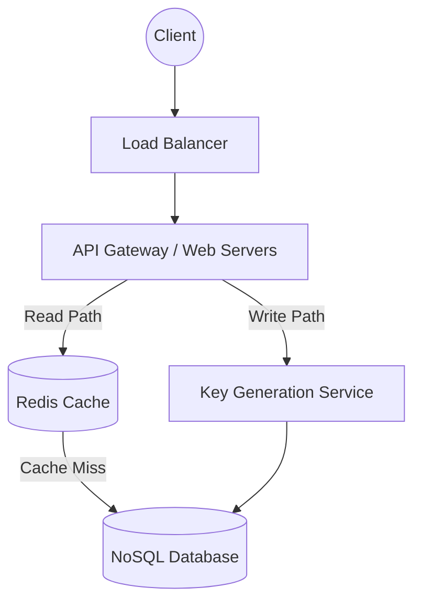

Designing a URL shortener like TinyURL or Bitly is the absolute classic System Design interview question. While the premise is incredibly simple — take a long URL and return a short one — the true test is how you scale the system to handle billions of requests with ultra-low latency.

---

## 1. Requirements Gathering

Before designing anything, we must define the scope of the system.

### Functional Requirements
- **Shorten:** Given a long URL, return a unique short URL (e.g., `https://tiny.url/x7Fg9`).
- **Redirect:** Given a short URL, redirect the user to the original long URL.
- **Custom Links:** Users can optionally pick a custom short link.
- **Expiration:** Links expire after a default timespan, but users can specify an expiration date.

### Non-Functional Requirements
- **High Availability:** The redirect service must never go down. If it fails, all links across the internet break.
- **Low Latency:** URL redirection must happen in under 10 milliseconds.
- **Unpredictability:** Short links should not be easily guessable (security by obscurity).

---

## 2. Capacity Estimation (Back-of-the-Envelope)

System design requires math to justify architectural decisions. Let's assume the following traffic:
- **Traffic Ratio:** The system will be heavily read-heavy. Let's assume a 100:1 read-to-write ratio.
- **Writes:** 100 million new URLs generated per month.
- **Reads:** 10 Billion redirections per month.

**Storage Requirements:**
If we store URLs for 10 years:
$100$ Million $\times 12$ months $\times 10$ years = $12$ Billion records
If each record is ~500 bytes (long URL, short hash, user ID, creation date), the total database storage is:
$12$ Billion $\times 500$ bytes $\approx 6$ Terabytes (TB)

Because 6TB easily fits on a few modern SSDs, but the sheer volume of reads (10 Billion/month) is massive, our primary bottleneck is **I/O throughput and latency, not raw storage space**.

---

## 3. Core Algorithm: The Encoding Strategy

How do we actually generate the short string (like `x7Fg9`)?

### Length of the Short URL
We use **Base62 encoding** (A-Z, a-z, 0-9). 
- A 6-character Base62 string gives $62^6 = 56.8$ Billion unique strings.
- A 7-character Base62 string gives $62^7 = 3.5$ Trillion unique strings.
Since we only need 12 Billion records for 10 years, a **7-character string** provides more than enough runway.

### Approach 1: Hash Function + Collision Resolution
Pass the long URL through a standard hash function like MD5 or SHA-1, which outputs a long hex string. We take the first 7 characters of that string.
- **The Problem:** Hash Collisions! Two different long URLs might result in the exact same first 7 characters.
- **The Fix:** If a collision occurs, append a unique counter to the long URL and re-hash it until it finds a unique spot in the database.

### Approach 2: Base62 Conversion (The Industry Standard)
Instead of hashing the URL, we rely on the Database's auto-incrementing Primary Key (ID).
1. Insert the long URL into the database to get a unique integer ID (e.g., ID = 125).
2. Convert that base-10 Integer into a Base62 string.
3. Update the record with the Base62 string.

```ts
// Example Base62 Conversion
const characters = '0123456789abcdefghijklmnopqrstuvwxyzABCDEFGHIJKLMNOPQRSTUVWXYZ';

function encodeBase62(id: number): string {
  if (id === 0) return characters[0];
  let shortUrl = '';
  
  while (id > 0) {
    const remainder = id % 62;
    shortUrl = characters[remainder] + shortUrl;
    id = Math.floor(id / 62);
  }
  return shortUrl;
}
```

**The Distributed ID Generator Problem:** 
In a distributed environment, a single database auto-incrementing ID becomes a massive bottleneck. You must use a distributed ID generator (like **Twitter Snowflake** or a highly-available Zookeeper cluster) to guarantee unique integer IDs across multiple database instances without locking.

---

## 4. High-Level Architecture



### The Database Choice: SQL or NoSQL?
We need a database that scales horizontally to handle massive Read operations. 
- There are no complex relational joins required. 
- We need extremely fast Key-Value lookups.
**Decision:** A NoSQL database like **Amazon DynamoDB** or **Cassandra** is the perfect choice.

### The Key Generation Service (KGS)
Instead of generating the Base62 strings on the fly (which causes latency and race conditions), we create a standalone **Key Generation Service (KGS)**. 
- The KGS pre-computes millions of random 7-character strings and stores them in a separate database table.
- When a web server needs to shorten a URL, it simply requests an unused key from the KGS. 
- This completely eliminates collisions and distributed ID generation bottlenecks!

---

## 5. Caching for Ultra-Low Latency

Because the read-to-write ratio is 100:1, querying the database for every single redirect will overwhelm it. Furthermore, some links (like a viral tweet) will be accessed millions of times an hour (the "Hot Key" problem).

We introduce a distributed caching layer (like **Redis** or **Memcached**).

1. When a redirect request hits the server, check Redis.
2. If the URL is in Redis (Cache Hit), instantly return the HTTP 301 redirect.
3. If not (Cache Miss), fetch it from DynamoDB, load it into Redis, and return the redirect.

### Memory Sizing the Cache
Following the **80/20 rule** (80% of traffic is generated by 20% of the links), we only need to cache 20% of the daily traffic.
- Daily read traffic: 330 Million requests.
- 20% of 330 Million = 66 Million records cached.
- $66$ Million $\times 500$ bytes $\approx 33$ Gigabytes (GB) of RAM.
This easily fits onto a single modern Redis node, though we'd use a replicated cluster for high availability.

### 301 vs 302 Redirects
- **HTTP 301 (Permanent Redirect):** The browser aggressively caches the response locally. Future visits by the same user don't hit our servers at all. This massively reduces server load, but ruins our ability to track analytics.
- **HTTP 302 (Temporary Redirect):** The browser does not cache the redirect. The user hits our server every single time. This increases server load but provides 100% accurate click analytics.

For a commercial service like Bitly, HTTP 302 is usually chosen to provide analytics to paying customers.

## Related Articles
- [Designing an API Rate Limiter](/blog/sysdesign-rate-limiter)
- [Distributed Key-Value Store Architecture](/blog/sysdesign-key-value-store)
