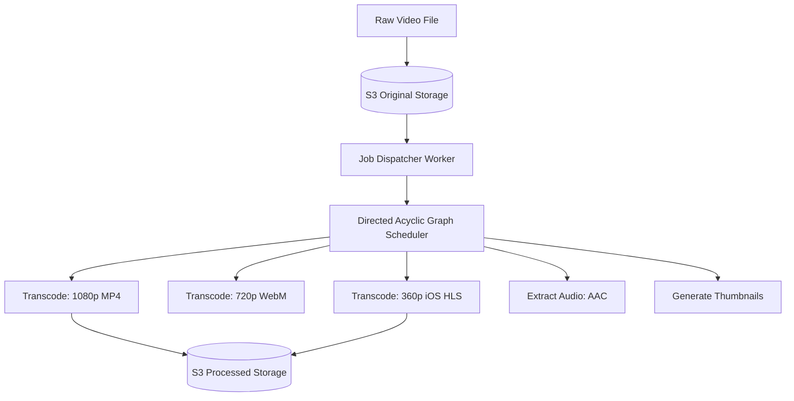

Designing a video streaming system like YouTube, Netflix, or TikTok is fundamentally different from a standard web application. Standard apps transfer a few kilobytes of JSON data. Video platforms transfer Petabytes of continuous, high-bandwidth blob data globally without buffering.

---

## 1. Video Formats and Protocols

You cannot simply upload an MP4 file to a server and have millions of users download it simultaneously. If a user on a slow 3G connection tries to download a 4K video, it will buffer indefinitely.

### Video Chunking
Videos are split into tiny chunks (e.g., 4 to 10 seconds long). Instead of downloading a massive 2GB file, the video player downloads hundreds of tiny 2MB files sequentially.

### Adaptive Bitrate Streaming (ABR)
Modern video players (like Netflix's web player) continuously monitor your internet connection speed. 
- If your connection is fast, the player requests the next 4-second chunk in 1080p.
- If you drive into a tunnel and your connection drops, the player instantly requests the *next* 4-second chunk in 360p to prevent the video from buffering.

This magic is powered by protocols like **HLS (HTTP Live Streaming)** by Apple and **MPEG-DASH**.

---

## 2. The Transcoding Pipeline (DAG)

When a creator uploads a raw 4K video to YouTube, it must be converted into multiple formats, resolutions, and bitrates to support every device in the world (from an iPhone 6 to a 4K Smart TV).

This requires a massive compute cluster to perform Video Transcoding.

Because video processing takes hours, the pipeline is modeled as a **Directed Acyclic Graph (DAG)**.
A DAG scheduler (like Apache Airflow) takes the original video, splits it into parallel jobs, and distributes those jobs across hundreds of worker servers. One server converts chunk 1 to 1080p, while another server converts chunk 2 to 720p simultaneously. 

---

## 3. High-Level Delivery Architecture

Serving video out of a centralized database is a fatal architectural mistake. The bandwidth costs would bankrupt the company, and users on the other side of the planet would experience massive lag.

### The Content Delivery Network (CDN)
100% of video delivery is handled by a CDN.
A CDN is a global network of "Edge Servers". When Netflix releases a popular new show, they proactively push the video chunks to thousands of CDN servers located directly inside local Internet Service Providers (ISPs) all over the globe.

When a user in London clicks "Play", the video isn't streamed from Netflix headquarters in California. It is streamed from a physical server located a few miles away in London.

---

## 4. Metadata and Search Database

While the actual video files live in S3 and CDNs, the *Metadata* (Video Title, Description, View Count, Comments, Likes) lives in a standard database.

Because YouTube has billions of videos and trillions of views, a standard SQL database will quickly bottleneck on the "View Count" updates.
- **Metadata DB:** A highly sharded SQL database (like MySQL via Vitess) or a NoSQL database (like Cassandra) stores the video titles and user profiles.
- **Search DB:** Every video title and description is piped into **Elasticsearch** to provide instant full-text search capabilities when a user types in the search bar.
- **View Counters:** Updating a view count directly in the DB for every single view is too slow. View counts are aggregated in memory (using Redis or a streaming engine like Flink) and flushed to the database in batches every few minutes.

## Related Articles
- [Designing a News Feed](/blog/sysdesign-news-feed)
- [Distributed Key-Value Store Architecture](/blog/sysdesign-key-value-store)
