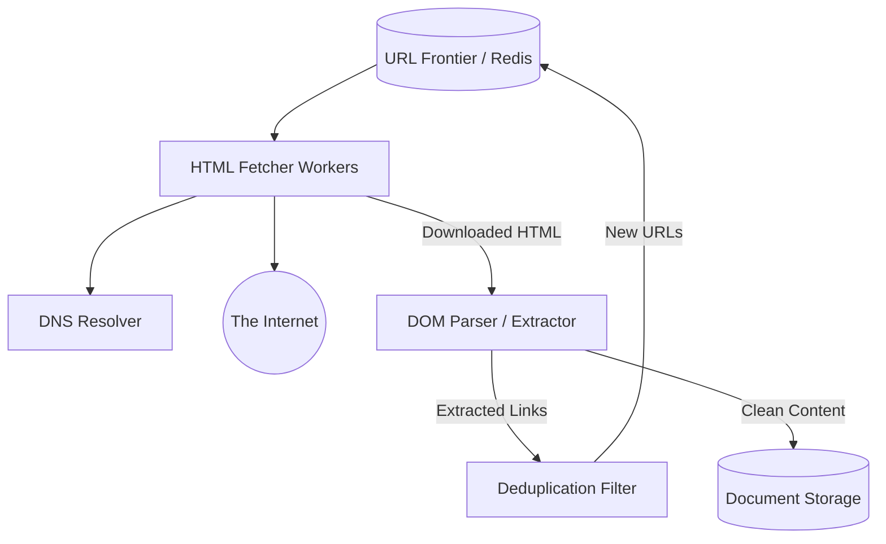

A Web Crawler (or Spider) is an automated bot that systematically browses the World Wide Web. It is the absolute foundation of Search Engines (Googlebot), Copyright Infringement monitors, and Web Archives (Wayback Machine).

Designing a distributed crawler is incredibly complex because the web is essentially an infinite, cyclic graph with hundreds of billions of nodes.

---

## 1. The Core Crawl Algorithm (BFS)

At a fundamental level, crawling the web is a Graph Traversal algorithm. The HTML pages are the "Nodes", and the hyperlinks (`<a href="...">`) are the "Edges".

Because we want to discover high-quality, closely-related pages first, we use **Breadth-First Search (BFS)** rather than Depth-First Search. DFS might get stuck traversing a single obscure blog 10,000 links deep, completely ignoring the rest of the internet.

### The Basic Loop
1. Given a set of starting URLs (Seed URLs), add them to a Queue.
2. Dequeue a URL.
3. Download the HTML of the URL.
4. Extract all hyperlinks from the HTML DOM.
5. Filter out URLs we have already visited.
6. Enqueue the new URLs back into the Queue.

---

## 2. High-Level Distributed Architecture

To crawl 1 Billion pages a month, a single machine with a `while` loop will not suffice. We need a highly distributed, asynchronous architecture.

### The URL Frontier (The Brain)
The Queue in a distributed crawler is called the **URL Frontier**. It is a massive, distributed priority queue (often backed by Redis or Apache Kafka). It determines exactly *what* URL to crawl next, prioritizing authoritative domains (like `.gov` or `.edu`) over spam domains.

### HTML Fetchers
Stateless worker nodes pull URLs from the Frontier. They resolve the domain via a custom DNS cache (DNS lookups are surprisingly slow and can bottleneck the entire system), establish a TCP connection, and download the raw HTML.

---

## 3. Politeness and Legal Constraints

If our crawler spun up 10,000 workers and immediately hit `small-blog.com` simultaneously, we would accidentally execute a massive Distributed Denial of Service (DDoS) attack and take the website offline. 

### Politeness Rules
The URL Frontier is responsible for enforcing politeness. It maintains an internal mapping ensuring that we wait at least $X$ seconds between consecutive requests to the same hostname.
This is implemented by maintaining hundreds of individual FIFO queues inside the Frontier — one queue per hostname. A worker thread is strictly assigned to a single queue, inherently guaranteeing that `small-blog.com` is only accessed linearly.

### Robots.txt
Before downloading any HTML, the crawler must fetch the `robots.txt` file from the host's root directory. This file dictates which endpoints the crawler is legally permitted to scan. Because fetching `robots.txt` for every URL is slow, the results are cached heavily in distributed memory.

---

## 4. The Deduplication Problem

The internet is a cyclic graph. `Page A` links to `Page B`, and `Page B` links back to `Page A`. If we don't track which URLs we have already visited, our crawler will get stuck in an infinite loop forever.

We need a massive "Seen URLs" datastore. 

### Bloom Filters to the Rescue
If we crawl 1 Billion URLs, storing them all in a standard Hash Set in RAM would require hundreds of Gigabytes of memory. 

To solve this, we use a **Bloom Filter**. A Bloom Filter is a highly space-efficient probabilistic data structure. 
- It can tell us if a URL is *definitely not* in the set.
- It can tell us if a URL is *probably* in the set (with a tiny ~1% false positive rate).

By using a Bloom Filter, we can compress the "Seen" list from 100GB of RAM down to a few hundred Megabytes. If the Bloom Filter says we've probably seen the URL, we might skip it (an acceptable loss of a few pages). If it says we definitely haven't seen it, we safely add it to the URL Frontier.

---

## 5. Content Parsing and Storage

Once the HTML is downloaded, it is passed to a DOM Parser. The parser strips out all HTML tags, JavaScript, and CSS, leaving only the raw semantic text content. 

This text is then saved into a **Document Storage** database (like Amazon S3 or a massive distributed file system like HDFS). Later, a separate batch-processing pipeline (like Apache Spark) will read this storage, calculate PageRank, and build the actual Inverted Index that powers the Search Engine.

## Related Articles
- [Distributed Key-Value Store Architecture](/blog/sysdesign-key-value-store)
- [Graph Traversals: Node Exploration using BFS and DFS](/blog/dsa-graphs-bfs-dfs)
